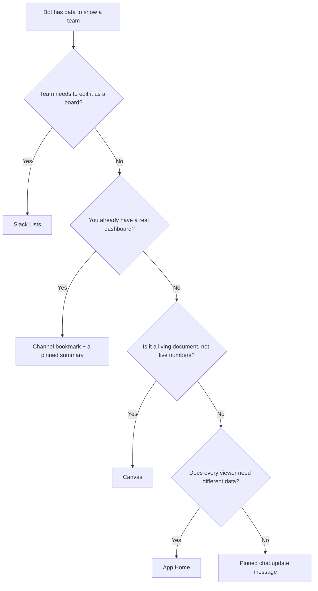

bot がチームに見せたいデータがある — ステータスボード、同期レポート、追跡中の作業アイテム一覧。Slack はそれを置く場所を 5 つ用意しているが、どれも互換ではない。誰に編集を許すか、更新にどれだけコストがかかるか、どれだけの視覚的構造を持てるかが、それぞれ異なるトレードオフになっている。

## 概要

| サーフェス | bot から書けるか | 読み取り専用の保証 | 更新コスト | 表現力の上限 |
|---|---|---|---|---|
| ピン留めした `chat.update` メッセージ | Yes | 絶対的 — 投稿したアプリだけが編集できる | API 呼び出し 1 回 | Block Kit（Table block を含む） |
| Slack Lists | Yes | 設定可能かつサーバー強制、ただし穴あり | 行ごとの管理が必要 | 本物のカンバンボード |
| 外部ダッシュボードへのチャンネルブックマーク | Yes | 自分のアプリ側で決まる | ゼロ — 常にライブ | 無制限 — 自分の UI だから |
| キャンバス | Yes | 設定可能 | 1 回、ただし文書全体の置き換え | Markdown 文書、表のみ |
| App Home | Yes | Yes | 更新ごとに O(users) 回の呼び出し | フル Block Kit、ただしユーザーごと |

## 決定木

## このセクションの内容

- [ダッシュボードサーフェスの選び方](./choosing-a-dashboard-surface.mdx) — 5 つのサーフェスすべてを順位付けした比較と、選択のルール
- [キャンバス](./canvas.mdx) — `canvases.create` / `canvases.edit` の書き込み経路、チャンネルキャンバス、`access.set` による読み取り付与の流れ、そして各種上限
