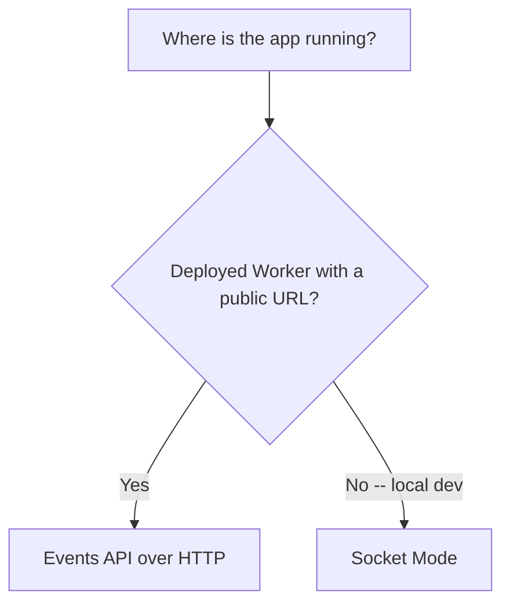

Slack がアプリにデータを push してくる形は 2 種類ある。

- **イベント** -- ワークスペース内で起きたこと（メッセージが投稿された、リアクションが
  付いた、チャンネルが作られた）。イベント種別ごとに購読し、OAuth スコープで許可される。
- **インタラクティビティ** -- アプリがレンダリングした Block Kit のコンポーネントに対して
  ユーザーが操作したこと（ボタンをクリックした、選択肢を選んだ）。1 操作につき 1 ペイロード。

本番ではどちらも、アプリの設定で登録した URL（イベント用の Request URL と、アクション用の
別の Interactivity Request URL）への署名付き HTTP POST として届く。そして Worker 側の扱い方も
両者で同じだ。署名を検証し、3 秒以内に 2xx で応答する。この共通の土台については
[リクエストの検証](../worker-backend/verifying-requests.mdx)と
[3 秒以内の ack](../worker-backend/three-second-ack.mdx)を参照。ローカルでは、この同じ
2 種類のペイロードが代わりに WebSocket 越しに届くこともある -- 後述の Socket Mode を参照 --
が、変わるのはトランスポートだけで、ペイロードそのものは変わらない。

## トランスポート: Events API と Socket Mode

Slack はイベントのトランスポートを 2 つ用意している。プロジェクト全体でどちらかに決めるので
はなく、環境ごとに選ぶ。

| | Events API（HTTP） | Socket Mode（WebSocket） |
|---|---|---|
| 方向 | Slack が公開 URL に POST する | アプリが Slack に WebSocket を張る |
| 公開 URL が必要か | Yes | No |
| ステートレスな Worker に合うか | Yes | No -- 接続を張り続ける必要がある |
| ここでの用途 | 本番 | ローカル開発のみ |

## このセクションの内容

- [Workers での Events API](./events-api-on-workers.mdx) -- 本番の経路。
  `url_verification` のハンドシェイク、リトライ、イベントの重複排除、購読スコープ
- [ローカル開発のための Socket Mode](./socket-mode-local-dev.mdx) -- Socket Mode が
  デプロイ済み Worker に合わない理由と、ローカルで反復開発するときの使い方
- [インタラクティビティのペイロード](./interactivity-payloads.mdx) -- `block_actions`
  ペイロードの構造と、その応答方法
