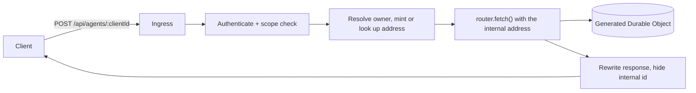

## このページの位置づけ

[コアコンセプトと API](./core-concepts-and-api.mdx)は、mount した conversation surface が何をするかを記録している。このページは、その周囲に application が何を作らなければならないかを記録する。マルチテナントなプロダクトが必要とする 3 つのもの——authentication、conversation 単位の ownership、削除——が、Flue 2.0.3 には設計上そもそも存在しないからである。以下の構成は [zudolab/zudo-text#4621](https://github.com/zudolab/zudo-text/issues/4621) で Flue 2.0.3 に対して実装された。反応の対象となっている Flue の挙動は検証済みの事実であり、構成そのものは設計案である。

:::tip[提案する契約]
このページの ingress、conversation index、delivery credential の table、削除の意味づけは、いずれも**このサイトが記述する application アーキテクチャ**である。どれも Flue の API ではない。それぞれの動機となる Flue の挙動は、検証済みの事実として別途ラベル付けしてある。
:::

## Router を mount しない

自明な構成は `createAgentRouter(agent)` を mount し、その前に authorization middleware を置くことである。それは動くし、[コアコンセプトと API](./core-concepts-and-api.mdx)が示しているのもそれである。より強い構成は、そもそも mount しないことである。

`createAgentRouter(agent)` は素の Hono app を返すので、application が組み立てた request を `router.fetch(request, env, ctx)` に直接渡して駆動できる。`app.route(mount, router)` は必須ではない。

違いはミスの代償である。mount の前に置いた `/*` middleware は routing のミスで迂回されうる——その上に登録された新しい route、glob に一致しない path、登録順を変えた refactor。mount されていない router へ到達できるのは application 自身の code が組み立てる path だけなので、確認を飛ばせる URL を client が発見する余地がない。



mount せず forward する構成からは、次の 2 点が直ちに帰結する。

- **受理 response は router が見た URL を名乗る。** その `streamUrl` field と `Location` header には*内部の* conversation id が入る。両方を書き換えなければ、client は内部 id を次の conversation 名として採用し、2 つ目の conversation を開いてしまう。書き換えるときは `Content-Length` を落とす。body の長さが変わるからである。
- **`offset` と `submissionId` は手を加えず通す。** これらは client の stream resume と終端判定の handle であり、書き換えれば両方が壊れる。

## Conversation address は server が mint する

:::note[検証済みの事実]
conversation id は caller が選ぶ path segment であり、mount した router は ownership を一切確認しない。認証済みユーザーは id を推測するだけで他人の conversation を読める。
:::

名前を付けるのは client、address を決めるのは server である。検証済みの context に random な末尾を足して導出する。

```
user:{userId}:vault:{vaultId}:conv:{clientConversationId}:{random}
```

そして対応関係を application 所有の index（address、owner、作成時刻、最終利用時刻）に保持する。こうすれば他人の client 側の名前を推測しても無害である。推測した値は key ではないからである。

この index は任意の帳簿ではない。Flue に列挙手段はないので、application が address を忘れた conversation は到達不能であると同時に**消去も不能**になる。何が存在するかを一覧する route は存在しない。

## Credential を delivery に載せない

:::danger[検証済みの事実: attributes は prompt text であり永続履歴である]
`renderSignalMessage()` は signal のすべての attribute をそのまま、`buildConversationContextEntries()` が model へ渡す文字列に書き出す。そしてすべての delivery は `GET /:id?view=history` が replay する append-only の record である。Flue 2.0.3 には model から見えない delivery ごとの channel が存在しない。検証の詳細は[コアコンセプトと API](./core-concepts-and-api.mdx)を参照する。
:::

したがって delivery が運ぶのは identity であり、秘密情報ではない。

| 値 | 経路 | 理由 |
|---|---|---|
| `userId`、`vaultId` | `initialData` | `useInitialData()` で読む。prompt には描画されない |
| Bearer token、key session id | conversation を key にした短命な application storage の行 | tool が実行時に読む。prompt にも履歴にも残らない |
| ユーザーの実際の依頼 | メッセージ body | これは prompt text であり、それこそが本来の用途である |

tool は credential の行を Durable Object の**内側から**読む。Worker の module scope に置いた map では動かない。tool は生成された Durable Object の中で実行され、そこは Worker の binding は共有するが isolate も request scope も共有しないため、その境界を越えられるのは共有 storage かメッセージ自身だけである。

これを単に整然としているだけでなく安全にする運用上の要点が 2 つある。credential の行には短い TTL を与える。そして credential を伴わない request が来たときは、書き込みを飛ばすだけでなくその行を**削除する**。行は 1 turn より長く生きるので、ユーザーが access を取り消した後に送られたメッセージが、それ以前の許諾に相乗りしてしまうからである。もう 1 つ、ingress は credential を検証せずに保存するため、失効した session は送信時の HTTP error ではなく、必ず turn の途中に `tool-output-error` chunk として現れる。client の復帰手順はそれを前提に設計する。consent を出し直し、turn を retry する。

## 削除は自前で持ち、正直に説明する

:::warning[検証済みの事実: Flue 2.0.3 に conversation を削除する手段はない]
router の `DELETE` もなく、store の delete もなく、列挙もなく、Cloudflare では instance ごとの Durable Object SQLite を破棄する runtime 手段もない。`POST /:id/abort` は作業を止めるだけで何も消さない。
:::

mint した address の random な末尾こそが、application 層の削除に意味を与える。index の行を削除すると Durable Object の stream は orphan になり、client 側の同じ名前で次にメッセージを送ると*別の* address、すなわち新しい instance が mint される。末尾がなければ削除は可逆になる。同じ client 側の名前を送り直せば履歴がまるごと復活してしまう。

ユーザー向けの文言は、実際に起きたことに合わせて書く。conversation は直ちに unlist され到達不能になり、そのバイト列は Durable Object とともに老朽化して消える。完全に消去されたわけではなく、そう主張するプロダクトは framework が守れない約束をしていることになる。

## CORS: 必要な client と、そうでない client がある

`Stream-Next-Offset`、`Stream-Up-To-Date`、`Location` の `exposeHeaders` は確かに効いてくる。ただしそれは response *header* を読む client に限る。browser の SSE client は各 `event: control` frame の中にある `streamNextOffset` から resume する。これは response body なので、素の `Access-Control-Allow-Origin` だけでも動く。header を読む long-poll や headless の client は、この設定がないと無言で壊れる。server は健全に見えたまま、古い offset から reconnect し続ける。いずれにせよ設定はする。どちらの失敗を防いでいるのかを分かったうえで設定する、というだけのことである。

## Test 可能性の代償

:::note[検証済みの事実]
Flue の router と model loop は、Miniflare 上の素の Hono app ではなく、Flue が build した Worker entry の中でしか動かない。「送信し、tool を呼び、返答する」を実際の model に対して駆動できる Vitest test は存在しない。
:::

したがって coverage は 3 層に分かれる。これを後から発見するより、最初から計画しておくほうが安上がりである。

1. **Ingress の HTTP contract**（fake router を使う）——認証、ownership、quota、id の書き換え、response の書き換え、削除。
2. **Tool の実行**（実物の tool factory を fake backend に対して動かす）——各 tool の contract。失敗時の文言と throw される error を含む。
3. **Live evaluation**（credential で gate し、deploy 済み環境に対して実行する）——model が本当に正しい tool を呼ぶことを証明できる唯一の層。

代わりの利点として、層 1 と層 2 は Miniflare + Flue の harness をまったく必要としない。`app.ts` は plugin なしでそのまま import できるからである。`cloudflare:workers` の import が `app.ts` から推移的に到達可能な位置にある場合は lazy な dynamic import のままにしておく。そうしないと Node 上の suite が module を読み込めない。

## 境界はどこにあるか

ここまでの内容は[Flue](./index.mdx)の境界を何も変えない。conversation は canonical store ではなく、tool は authorization boundary ではなく、ingress は自分が以前 mint した conversation id を信用するのではなく毎回の呼び出しを再認可する。ingress は application 所有のサービスがもう 1 つ増えたということであり、その前提で review すべきである。
