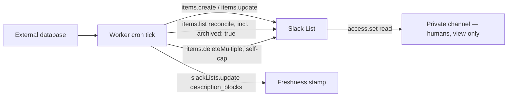

本セクションのすべてのページは、1 つの設計へ向かって積み上がっている。Cloudflare Worker の cron が外部データベースの行を Slack List へミラーし、bot トークンが**唯一**の書き手であり、リストを見られる人間は全員が読み取り専用アクセスを持つ、という設計だ。このページはそれを組み上げたもの — セットアップの仕組み、レート計算、そして「読み取り専用」が実際に何を保証し、何を保証しないのかを扱う。

外部データベース（またはソーステーブル）は、このパターンの生涯を通じて system of record であり続ける。リストはその上へ押し出された**ビュー**であって、逆ではない — リストが成長し続ける全履歴を安全に保持できないからこそ、[アイテム上限と自動アーカイブ](./item-caps.mdx)のすべてが存在する。



## 仕組みのチェックリスト

### 1. bot 自身がリストを作る

人間がリストを作ってから bot に共有するのではなく、bot に `slackLists.create` を呼ばせる。これで 2 つの問題が同時に解決する。

- **選択肢のスラッグを自分で決められる。** 表示ラベルは何であれ、中立的な ASCII の値（例: `todo` / `doing` / `done`）にできる — 人間が割り当てた不透明な `Opt…` 形式のスラッグを追いかける、値とラベルの不一致問題がまるごと消える。
- **作成者にはアクセスが暗黙に付く。** bot が自分で作った**のではない**リストに書き込みアクセスを得る方法は、本当に文書化されていない — `slackLists.access.set` が受け付けるのは `user_ids` か `channel_ids` だけで、シグネチャのどこにも `app_ids` や bot 用の引数はない。作成者は自分が作ったものにアクセスできる。未解決の疑問が付いていないアクセス経路はこれだけだ。

:::warning[未検証]
*人間*が作ったリストに対して bot へ書き込みアクセスを付与できるのか — bot 自身のユーザー ID を `access.set` の `user_ids` に渡す方法や、bot が所属するチャンネルへ共有する方法で — は文書化されていない。チャンネル共有をしたにもかかわらず `items.update` が `list_not_found` を返したというコミュニティの報告が 1 件あるが、GA 前のワークフロートークンの文脈なので、現代の `xoxb` bot トークンについて決定的とは言えない。実ワークスペースで決着をつけられたはずのこのプロジェクトの検証スパイクはスキップされた。**使い捨ての呼び出しで自分でその経路を実証するまで、「人間が作って bot に共有する」を前提に設計しないこと** — bot がリストを作る方式なら、この疑問自体を回避できる。
:::

### 2. チャンネルに読み取りアクセスを付与する

`slackLists.access.set` を 1 回、`access_level: "read"`、`channel_ids` は**プライベート**チャンネルを指す — なぜパブリックではなくプライベートなのか、そして直後に有効にすべき「Only you can share」設定については[権限と所有者](./permissions.mdx)を参照。

### 3. `list_id`、すべての `column_id`、すべての `row_id` を永続化する

ここに挙げるものはどれも、追加の呼び出しなしには再発見できない — マッピングを失った場合にそれを復旧する `items.info` のセンチネル行パターンについては[リストの読み取り](./reading-lists.mdx)を参照。

- `list_id` と書き込む各 `column_id` — `slackLists.create` のレスポンスから。
- ミラーするソース行ごとの `row_id` — `slackLists.items.create` から取得し、[イベントなし、冪等性なし](./no-events-no-idempotency.mdx)のとおり **create 呼び出しとアトミックに**自分のデータベースへ永続化する。

### 4. cron ティック: 保存済みの行 ID で upsert する

同期する各ソース行は、すでに `row_id` を保持しているかどうかで分岐する — なければ `items.create`、あれば `items.update`。これは[イベントなし、冪等性なし](./no-events-no-idempotency.mdx)で詳述している中核の冪等性メカニズムで、このパターンページはそれを前提に、その周囲を包むものへ話を進める。

### 5. `description_blocks` による鮮度スタンプ

同期が成功するたびに最後に `slackLists.update` を 1 回呼び、リストの説明を `Synced from <source> · 2026-08-06 14:32 · 187 rows` のような文字列へ書き換える。これは Tier 2 の呼び出し 1 回で済み、行には一切触れず、上限への影響もゼロだ — 行ごとの「最終同期」列よりはるかに安い鮮度シグナルになる。行ごとの列にすると同期あたり N 回の書き込みが必要になり、`updated_by` を見ている人からはすべての行が変更されたように見えてしまう。

```typescript
// NOTE: the argument is `id`, not `list_id` — the one method in the
// 12-method surface that names this argument differently from every
// items.* method, which all use `list_id`.
export async function stampFreshness(
  botToken: string,
  listId: string,
  sourceName: string,
  rowCount: number,
): Promise<void> {
  const timestamp = new Date().toISOString();
  const res = await fetch("https://slack.com/api/slackLists.update", {
    method: "POST",
    headers: {
      authorization: `Bearer ${botToken}`,
      "content-type": "application/json; charset=utf-8",
    },
    body: JSON.stringify({
      id: listId,
      description_blocks: [
        {
          type: "rich_text",
          elements: [
            {
              type: "rich_text_section",
              elements: [
                { type: "text", text: `Synced from ${sourceName} · ${timestamp} · ${rowCount} rows` },
              ],
            },
          ],
        },
      ],
    }),
  });
  // Slack's Web API returns HTTP 200 even on failure — {"ok": false, "error": "..."}.
  // This call is meant to run after every successful sync tick, so a swallowed
  // rejection here would leave a stale stamp while the tick still reports success.
  const body = (await res.json()) as { ok: boolean; error?: string };
  if (!body.ok) {
    throw new Error(`slackLists.update rejected: ${body.error}`);
  }
}
```

### 6. 定期的な照合、アーカイブパスも含めて

低頻度の全件パス — `items.list` をページングし、自分のデータベースと差分を取り、その後同じパスを `archived: true` でもう一度実行する。詳しい仕組みと、2 回目のパスが自動アーカイブの除去を見る唯一の方法である理由は[イベントなし、冪等性なし](./no-events-no-idempotency.mdx)を参照。

### 7. 明示的な削除による自己制限

Slack が報告している（そして未検証の）自動アーカイブ挙動に頼るのではなく、リストごとの実際の上限のはるか手前で `items.deleteMultiple` を使って自分の古い行を退避する。ポリシーの全体像とコピーして使える退避ヘルパーは[アイテム上限と自動アーカイブ](./item-caps.mdx)を参照。

### 唯一の手作業ステップ: ボードのセットアップ

ボードレイアウト、グループ化列、デフォルトビューは UI 限定かつ所有者が設定するものだ — [ボードレイアウト](./board-layout.mdx)を参照。これは[権限と所有者](./permissions.mdx)の所有者構成（bot が人間を所有者に昇格させるか、人間がリストを作成・設定して bot に書き込みアクセスを与えるか）に沿って、人間が一度だけ手作業で行う。cron ティックの一部ではなく、一度きりのセットアップコストである。

## ミラーのレート計算

アクティブ 300 行で自己制限したミラーを想定する（1,000 行の天井から十分手前に留まる理由は[アイテム上限と自動アーカイブ](./item-caps.mdx)を参照）。

| 操作 | 頻度 | 呼び出し数 | 階層 | おおよそのコスト |
|---|---|---|---|---|
| 初回バックフィル（300 行、`items.create`） | 1 回 | 300（1 行あたり 1 回） | 2 か 3 — 情報が対立、厳しいほうの Tier 2（20+/min）を想定 | 約 15 分 |
| 定常状態の更新（最悪ケース: 変更行あたり 1 回、`items.update`） | cron ティックごと | 最大 300 | Tier 3（50+/min） | 全件再同期で約 6 分 |
| 照合パス（`items.list`、ページネーション） | cron ティックごと、またはそれ以下 | 約 3（300 行 ÷ 約 100/ページ） | Tier 2（20+/min） | 数秒 |
| 鮮度スタンプ（`slackLists.update`） | 同期成功ごとに 1 回 | 1 | 元調査に記載なし | 無視できる |

:::warning[未検証]
定常状態の行は意図的に最悪ケースにしてある。`row_id` は `items.update` のトップレベルではなく各 `cells[]` エントリの内側にあるため、構造上は 1 回の呼び出しで多数の異なる行のセルを 1 リクエストに載せられる*可能性がある* — しかし文書化されたサンプルはどれも 1 行に対する 1 セルだけを示しており、複数行のバッチ処理が動作するとも対応しているとも述べたページはない。これはこのパターン全体で最も影響の大きい未知だ。数百行の変更に対して、同期が約 5 秒で済むのか約 6 分かかるのかの違いになる。実際のリストに対して複数行の `cells[]` ペイロードを試せたはずのこのプロジェクトのスパイクはスキップされた。**バッチ処理に依存する設計を確定させる前に、実証的にテストすること。** そして答えがどちらであれ、cron ハンドラが次のティックと重ならないよう実行ロックかリースでガードすること — [イベントなし、冪等性なし](./no-events-no-idempotency.mdx)を参照。

これとは別に、`items.create` のレート階層そのものが 2 つの Slack 公式ソース間で対立している（ドキュメントは Tier 2、Java SDK の機械可読なレート制限メタデータは Tier 3）— バックフィルのサイズを見積もるときは、上の表と同様に厳しいほうの Tier 2 を想定すること。
:::

## 読み取り専用が与えてくれないもの

`read` アクセスの付与は実在するサーバー強制の制限だ — しかしそれは沈黙の保証ではないし、絶対でもない。

- **閲覧者はアイテムのスレッドでコメントを読むことも投稿することもできる。** 「読み取り専用」のボードでも議論は起こり得る。直接編集ができないだけだ。
- **所有者と管理者はいつでもリスト全体を削除できる。** 他の誰がどのアクセスレベルを持っていようと関係ない。管理者のオーバーライドを防ぐ ACL 設定は存在しない。
- **公開された Form ワークフローはアクセスレベルを完全に迂回する** — ミラーされたリストには一切公開しないこと。

5 つの穴の全リストと、このパターンが依存する所有者構成は[権限と所有者](./permissions.mdx)を参照。

## セットアップチェックリスト

1. ワークスペースが有料プラン（Pro 以上）であり、管理者によって Lists が無効化されていないことを確認する。
2. アプリに `lists:read` と `lists:write` スコープを追加して再インストールする（スコープの追加は再インストールを強制する）。
3. 所有者構成を選ぶ（[権限と所有者](./permissions.mdx)を参照）。どちらを選んでも書き込み権を持つ人間はちょうど 1 人になる — その人の名前を runbook に記録すること。
4. `access_level: "read"` で、リストを**プライベート**チャンネルへ共有する。
5. **「Only you can share」**（共有 → 詳細設定）を有効にし、読み取りアクセスが付与先を越えて広がらないようにする。
6. リスト上に **Form ワークフローを一切公開せず**、フィールド変更通知はテストが済むまでオフのままにする — （人間の編集ではなく）API 由来の書き込みが「フィールド変更時に通知」する自動化を発火させるかは文書化されておらず、もしそうだとしたら、毎ティックでセルを書き換える cron がチャンネルを通知で埋め尽くしかねない。
7. 管理者がいつでもボードを削除できること、そして閲覧者がアイテムのスレッドにコメントできることを、最初から受け入れておく — どちらもセットアップの不備ではなく、Lists の仕様である。

## 関連ページ

- [リストの読み取り](./reading-lists.mdx)
- [イベントなし、冪等性なし](./no-events-no-idempotency.mdx)
- [アイテム上限と自動アーカイブ](./item-caps.mdx)
- [権限と所有者](./permissions.mdx)
- [ボードレイアウト](./board-layout.mdx)
