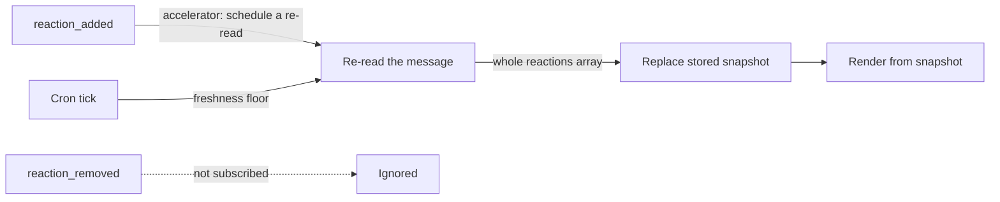

リアクションは bot にとって、互いに無関係な 2 つのものだ。**読む**側から見れば、チャンネルが
生み出す最も安価なシグナルであり — 投票、了解、トリアージの判断が、それが当てはまるメッセージ
にすでに紐づいた形で得られる。人間が払うコストはクリック 1 回で、覚えることは何もない。
**書く**側から見れば、チャンネルにいる全員が何も開かずに見られる場所に、少量の永続的な状態を
置ける手段だ。どちらの方向にも鋭い落とし穴があり、しかもそれらは別々の落とし穴だ。そして両者を
つなぐ `reaction_added` のイベントストリームにも、また別の落とし穴がある。

## リアクションを付ける

### パラメータ名は `ts` ではなく `timestamp`

`reactions.add` が取るのは `channel`、`name`（前後のコロンを含まない絵文字名）、そして
`timestamp` — リアクションを付ける対象メッセージの `ts` だ
([`reactions.add`](https://docs.slack.dev/reference/methods/reactions.add/))。この 3 つ目の名前
が罠になる。メッセージオブジェクトはこの値を `ts` として持つ。`conversations.history` と
`conversations.replies` は `ts` として返す。`chat.update` は `ts` として受け取る。ところが
`reactions.add` は `timestamp` として受け取り、`reactions.get` と `reactions.remove` も同じだ。
つまり命名は `reactions.*` ファミリーの*内側*では一貫していて、ファミリーを*またぐ*ときに食い
違う — コードレビューをすり抜けてしまう典型的な形をしている。

失敗の仕方も、いちばん厄介な意味で静かだ。すでに `ts` を持つパラメータオブジェクトをそのまま
`reactions.add` へ展開して渡すと、timestamp はまったく送られない。それでもレスポンスが文句を
言う先はフィールド名ではなく item なので、「そのメッセージは存在しない」と読めてしまい、
「こちらではパラメータ名が違う」とは読めない。境界となるラッパー 1 か所で名前を変換し、この
呼び出しを 2 度手書きしないこと。

### `already_reacted` は冪等な成功

トークンの主体がすでにそのメッセージへ付けている絵文字に対して `reactions.add` を呼ぶと、
`ok: false` と `error: "already_reacted"` が返る。これは形式上のエラーにすぎない — 呼び出し側
が求めた状態（そのメッセージに、その主体による、そのリアクションが付いていること）はすでに
成り立っている。このエラーコードだけを成功として扱うことが、bot のリアクションを安全にリトライ
できる副作用へと変える。

```typescript
export async function markMessage(
  botToken: string,
  channel: string,
  messageTs: string,
  name: string,
): Promise<void> {
  const res = await fetch("https://slack.com/api/reactions.add", {
    method: "POST",
    headers: {
      authorization: `Bearer ${botToken}`,
      "content-type": "application/json; charset=utf-8",
    },
    // `timestamp`, not `ts` — reactions.* names this parameter differently
    // from conversations.history / conversations.replies / chat.update.
    body: JSON.stringify({ channel, timestamp: messageTs, name }),
  });
  const body = (await res.json()) as { ok: boolean; error?: string };

  // The marker is already there, which is the postcondition this call wanted.
  if (!body.ok && body.error !== "already_reacted") {
    throw new Error(`reactions.add failed: ${body.error}`);
  }
}
```

この 1 つの分岐があるおかげで、この呼び出しは重複配送が起こりうるあらゆる場所に置ける。Slack
が最大 3 回リトライしうる Events API のハンドラーの中でも、すでに走査した区間を再走査する cron
のパスの中でも、at-least-once セマンティクスのキューコンシューマーの中でもだ。これがないと、
重複のたびに失敗としてログに残り、`ok: false` をすべて「あとで再試行」と解釈するリトライ
ラッパーは、結果が決して変わらない呼び出しに予算を使い切ってしまう。

### 永続的な状態マーカーとしての bot の絵文字

呼び出しが冪等になれば、bot 自身のリアクションは、データベースの行にはない性質をもつ状態
フィールドになる。事実が当てはまるまさにその場所に描画され、読むための UI が要らず、「これは
処理済みか」に答えるためのクエリが要らず、bot 自身のストレージを作り直しても生き残る。ある
本番のリファレンス実装は、まさにこれを取り込み済みマーカーとして使っている — 元メッセージの
処理が終わった瞬間に、bot がそこへチェックマークを付ける。

小さな語彙で十分に足りる。

| マーカー | 意味 |
|---|---|
| `:eyes:` | 着手済み、処理中 |
| `:white_check_mark:` | 正常に処理完了 |
| `:warning:` | 試して失敗 — 詳細はスレッドに |

語彙は短く保ち、詳細はスレッドの返信に置く。リアクションは「これはどの状態か」に答え、スレッド
は「なぜか」に答える。

### bot のリアクションは事実上取り消せない

Slack はリアクションの削除を、それを付けた主体だけに許している。`reactions.remove` が消せるのは
認証された主体自身のリアクションであり、クライアントでリアクションのピルをクリックしても切り
替わるのは自分の分だけだ。他人のリアクションを削除する API は存在せず、それを可能にする管理者
権限の上書きもない。

bot のマーカーについてこれが意味するのは、ワークスペース内でそれを外せる唯一の存在が、同じ
トークンで `reactions.remove` を呼ぶ bot 自身だということだ — 処理を起動した本人でもなければ、
チャンネルのオーナーでも、ワークスペースの管理者でもない。アプリが取り消しの経路を意図的に用意
しないかぎり、付けたマーカーは人間の目から見ればすべて恒久的なものになる。

したがって `reactions.add` の 1 回 1 回は、実装の細部ではなくプロダクトの判断だ。

- **一方向であることを明記する。** bot が何をするのかをユーザーが知る場所に書く。「bot が付けた
  マークは誰も外せない」は意外性のあるルールであり、先に伝えるほうが、後から発見されるより
  はるかに安上がりだ。
- **行ったり来たりして当然の状態を載せない。** また外す必要があるマーカーの居場所は、スレッド
  の返信か `chat.update` で更新されるメッセージ本文であって、リアクションではない。
- **取り消しが本当に要件なら、作る。** bot トークンで `reactions.remove` を呼ぶ明示的なアプリの
  アクション — スラッシュコマンドやボタン — だけが、存在する唯一の手段だ。

これは Slack のリアクションモデルに固定された仕様であって、将来のリリースで埋まる隙間ではない。
待つのではなく、これを前提に設計する。

## リアクション状態を読む

`conversations.history` と `conversations.replies` は、各メッセージを `reactions` 配列とともに
返す。この配列は集計値ではない。素直に読むと間違える理由が 3 つ別々にあり、現実的なペイロード
にはその 3 つが同時に現れる。

```json
"reactions": [
  { "name": "+1", "count": 3, "users": ["U01", "U02", "U03"] },
  { "name": "+1::skin-tone-3", "count": 1, "users": ["U04"] },
  { "name": "thumbsup", "count": 1, "users": ["U01"] },
  { "name": "eyes", "count": 42, "users": ["U01", "U02", "U03", "U04", "U05"] }
]
```

### スキントーンの派生は別のエントリとして届く

Slack の設定でスキントーンを選んでいる読み手は `+1` ではなく `+1::skin-tone-3` を送るので、それ
は独自の `count` と `users` をもつ別のエントリとして届く。この接尾辞は表示上の修飾子であって
（`::skin-tone-2` から `::skin-tone-6` まで。既定の黄色には接尾辞が付かない）、別のリアクション
ではない — チャンネルにいる誰も、2 つのピルが違うことを表しているとは読まない。

接尾辞を取り除き、同じベース名に潰れたエントリ同士をマージする。ユーザー集合は和集合を取り、
互いに素だと決めつけずに重複を除くこと。クリックの合間にスキントーンの設定を変えた人は、2 つの
派生エントリの両方に現れうるからだ。

### エイリアスは 1 つの意味に対する 2 つの名前

`+1` と `thumbsup` は 2 つの名前をもつ同じ絵文字であり、`-1` と `thumbsdown` も同様だ。どちらの
名前で届くかはリアクションの付けられ方によるので、1 つのメッセージに両方が現れうる。上の
ペイロードでも `U01` が両方に登場している。`+1` のファミリー全体 — エイリアスとスキントーンの
派生をまとめて — を素朴に足し上げると賛成は 3 + 1 + 1 = **5** 件と報告されるが、実際にいる人は
`U01`、`U02`、`U03`、`U04` の **4** 人だ。

帰結は 2 つ。絵文字と意味を対応づけるテーブルは、その意味に対応する*すべての*名前にマッチしな
ければならない。設定ファイルにたまたま書かれた 1 つだけでは足りない。そしてエイリアスをまとめる
集計は、ユーザー ID で重複を除かなければならない。`count` の単純な合計は、両方を使った人を二重
に数えてしまうからだ。

### 信頼できるのは `count` であって `users[]` ではない

リアクションが多く付いたメッセージでは `users` が切り詰められる一方、`count` は本当の総数を報告
し続ける — 上の `eyes` のエントリは、ID を 5 件だけ並べながら 42 と言っている。**`users.length`
から件数を導いてはいけない。** 切り詰めの境界はハードコードしてよい数値ではない。
`users.length < count` となるエントリはすべて切り詰められたものとして扱い、そのまま進めればいい。

これに耐える形は、1 つの数値ではなく 2 つの数値をもつことだ。`count` から得た総数と、`users` から
得た既知の集合。その差は「+N」として描画する — 「既知 5 人、他 +37」は誠実で、「5」はバグ、
「42 人の名前がわかっている」は嘘だ。

派生とエイリアスのマージは、切り詰めと 1 点だけ相互作用する。`users` の和集合が正確なのは、
マージしたどのエントリも切り詰められていない場合にかぎる。1 つでも切り詰められていれば、合計
した `count` は上限値であり（エイリアスや派生をまたいで同じユーザーを二重に数えうる）、和集合は
下限値になる。両方を保持し、描画した数値がどちらから来たものかを明示すること。

```typescript
const SKIN_TONE = /::skin-tone-[2-6]$/;

// Alias pairs are distinct API names for one emoji; map every name to one key.
const ALIASES: Record<string, string> = {
  thumbsup: "+1",
  thumbsdown: "-1",
};

export function canonicalReactionName(name: string): string {
  const base = name.replace(SKIN_TONE, "");
  return ALIASES[base] ?? base;
}

type SlackReaction = { name: string; count: number; users?: string[] };

export type ReactionTally = {
  name: string;
  totalCount: number; // summed `count` — authoritative per entry, upper bound once merged
  knownUsers: Set<string>; // deduped across variants and aliases; lower bound if truncated
  truncated: boolean;
};

export function tallyReactions(reactions: SlackReaction[] = []): Map<string, ReactionTally> {
  const byName = new Map<string, ReactionTally>();

  for (const reaction of reactions) {
    const key = canonicalReactionName(reaction.name);
    const tally = byName.get(key) ?? {
      name: key,
      totalCount: 0,
      knownUsers: new Set<string>(),
      truncated: false,
    };

    tally.totalCount += reaction.count;
    for (const user of reaction.users ?? []) tally.knownUsers.add(user);
    // `users` is capped on busy messages; `count` is the number to trust.
    if ((reaction.users?.length ?? 0) < reaction.count) tally.truncated = true;

    byName.set(key, tally);
  }

  return byName;
}
```

:::tip[1 つのメッセージのリアクションだけを読む]
メッセージ ID がすでに手元にあるのに、そこへ辿り着くために `conversations.history` をページング
するのは無駄だ。`conversations.history` は `latest: <ts>` に `inclusive: true` と `limit: 1` を
添えることでそのメッセージだけを取得できるし、
[`reactions.get`](https://docs.slack.dev/reference/methods/reactions.get/) はアイテムのリアク
ションを直接読める — 引数は `channel` と `timestamp` で `reactions.add` と同じ命名であり、完全な
リアクション一覧を返す `full` フラグもそのリファレンスページに記載されている。どちらを呼ぶに
せよ、`users.length` ではなく `count` を信じるという原則は変えないこと。コストはゼロで、どこでも
成り立つ。
:::

### スレッドの返信は自分自身のリアクションをもつ

スレッドの返信に付いたリアクションは、その返信自身の `ts` に紐づく。親メッセージの `reactions`
配列には決して現れないし、親のリアクションが返信側に現れることもない。2 つのスコープは、見た目
が入れ子になっているだけの別々のメッセージにすぎない。

そのため、どの読み取りメソッドを使うかが答えの一部になる。`conversations.history` が返すのは
トップレベルのメッセージなので、見えるのは親のリアクションだけだ。`conversations.replies` は親と
その返信を返すので、両方のスコープを見られるのはこちらになる。したがって「5 人が承認した」と
報告する機能は、どちらのスコープを数えたのか — 親だけか、親と返信の両方か — を明示しなければ
ならない。同じスレッドを違うスコープで読む 2 つの連携は、同一のデータから違う数値を出す。そして
そのどちらも間違ってはいない。

## `reaction_added` イベントを扱う

[`reaction_added`](https://docs.slack.dev/reference/events/reaction_added/)（スコープは
`reactions:read`）を購読すると、リアクションはプッシュ型のシグナルになる。

```json
{
  "type": "reaction_added",
  "user": "U024BE7LH",
  "reaction": "white_check_mark",
  "item_user": "U0G9QF9C6",
  "item": { "type": "message", "channel": "C0G9QF9GZ", "ts": "1360782400.498405" },
  "event_ts": "1360782804.083113"
}
```

### 動く前に絞り込む

イベントに何かをさせる前に、この順番で 3 つのチェックを行う。

```typescript
type ReactionAddedEvent = {
  type: "reaction_added";
  user: string;
  reaction: string;
  // A file item carries no `channel` / `ts` — read them only after the type check.
  item: { type: string; channel?: string; ts?: string };
  event_ts: string;
};

export function shouldHandle(
  event: ReactionAddedEvent,
  botUserId: string,
  watchedChannels: ReadonlySet<string>,
): boolean {
  if (event.item.type !== "message") return false;
  if (!event.item.channel || !watchedChannels.has(event.item.channel)) return false;
  if (event.user === botUserId) return false; // the app's own reactions.add calls
  return true;
}
```

1. **`event.item.type` は必ずしも `message` ではない。** ファイルへのリアクションも同じ購読で
   届き、ファイルの item には `channel` もメッセージの `ts` もまったく存在しない。型を確認する
   前に `event.item.channel` を読むコードは、アップロードされたスクリーンショットに絵文字が
   1 つ付いただけで、undefined のチャンネル ID を Web API 呼び出しへ流し込む。
2. **チャンネルを確認する。** 購読はアプリから見えるすべてのチャンネル分を配送するのであって、
   個々の機能が関心をもつ 1 つのチャンネルだけではない。決め打ちせず、明示的な集合と照合する。
3. **アプリ自身のリアクションを落とす。** アプリが実行した `reactions.add` は、すべて
   `reaction_added` イベントとして自分に返ってくる。メッセージイベントと違い、ここには判定に
   使える `bot_id` フィールドがない — 唯一の判別材料は `event.user` とアプリ自身の bot ユーザー
   ID の比較であり、後者は `auth.test` の `user_id` から得られる。起動時に 1 度だけ取得して
   キャッシュすること。イベントごとに `auth.test` を呼んではいけない。このチェックを飛ばすと、
   リアクションに反応してリアクションを付ける bot は、自分で自分をトリガーし続けることになる。

### イベントの同一性は事実の同一性ではない

エンベロープの `event_id` による重複排除は Events API の標準的な防御であり、必要でもある —
Slack は 1 つの配送を最大 3 回リトライするからだ。だがそれが守ってくれるのは*同じ配送が 2 度
届くこと*だけで、それ以上ではない。

リアクションを外して付け直すと — 同じ人が、同じ絵文字を、同じメッセージに — Slack はまったく
新しい `event_id` を発行する。台帳から見ればそれは新しいイベントなので、冪等でないハンドラーは
2 度目の実行に入る。しかもリアクションのピルをダブルクリックするだけで、誰でもこれを起こせる。

副作用の鍵は、配送ではなく事実のほうに置く。`(channel, メッセージの ts, リアクション名, 反応した
ユーザー)` か、「最初のチェックマークでこれを閉じる」というルールなら `(channel, メッセージの
ts)` だけでいい。`event_id` の台帳は配送の重複排除のために残し、そこへ事実の鍵を足す — 2 つの
防御は別々の問いに答えるので、両方とも欲しい。

### 堅牢な消費パターンは「読んで置き換える」

本番で持ちこたえるパターンは、イベントソーシング的な直感を逆さまにする。イベントの差分を保存済み
の集計に適用してはいけない。そうではなく、定期的にメッセージの `reactions` 配列全体を読み直し、
保存しているスナップショットを丸ごと**置き換える**。イベントのほうは、その読み直しを早めるだけの
低遅延なアクセラレーターとして扱う。



`reaction_removed` はそもそも購読しない。置き換えという手順の副産物として — 作り込むべき機能と
してではなく — 3 つの失敗モードが消える。

| 失敗 | 自己修復する理由 |
|---|---|
| 削除 | 次の読み直しでそのリアクションが見えなくなるだけ。削除イベントは要らない |
| 配送の欠落・取りこぼし | 次のポーリングまでの鮮度を失うだけで、正しさは失わない |
| 順序の乱れ | 差分を適用しないので、狂いようのある順序が存在しない |

代償はポーリング間隔で上限が決まる鮮度の遅れだ — 描画される状態がどれだけ古くてよいかから
その間隔を決め、イベントが届いたときにはそれを手前へ引き寄せてもらえばいい。なお非 Marketplace
のアプリでは `conversations.history` と `conversations.replies` が 1 分あたり 1 リクエスト・
最大 15 オブジェクトまで削られているため、イベントごとの読み直しはそうしたアプリでは成立
しない。ナッジはまとめ、バッチ化したスイープで読み直すこと。
