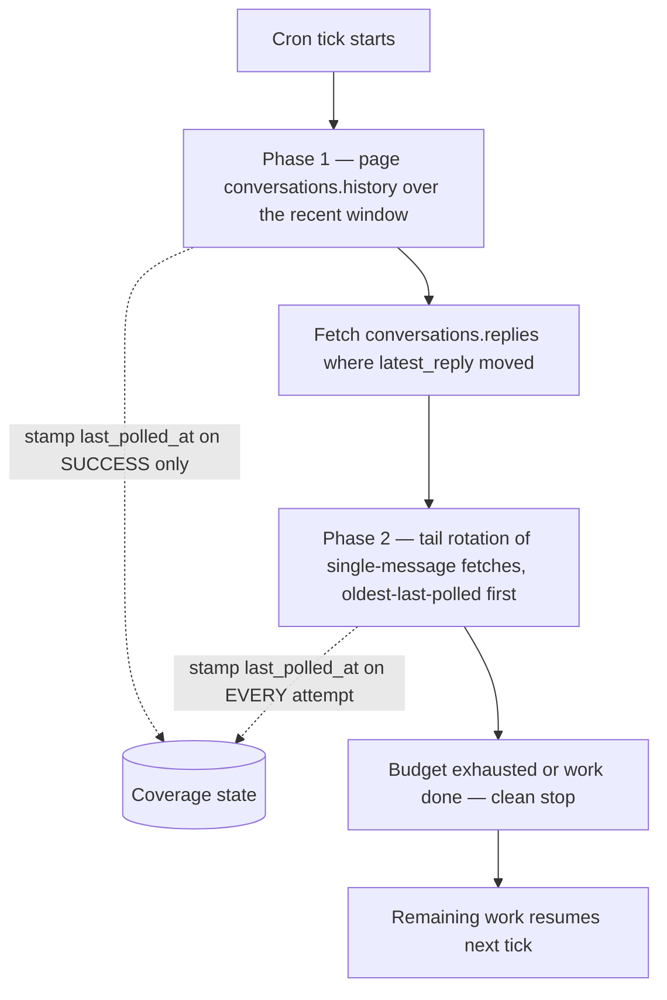

チャンネルで何が起きたかを知るために、bot が Events API を使わなければならないわけではない。
`conversations.history` と `conversations.replies` は、cron で回す**読み取りモデル**として
ポーリングできる。tick ごとにある範囲のメッセージの現在の状態を取得し、ローカルの保存内容を
返ってきた内容に合わせて書き直す、というやり方だ。本番運用されているリファレンス連携はまさに
この形で動いており、非 Marketplace アプリに課される毎分およそ 1 リクエストという縮小後の上限の
もとで、それを継続して成立させている。このページに並ぶ仕組みは、すべてその制約から形が決まって
いる。

ここでのポーリングは「イベントをうまく動かせなかったから仕方なく」の選択ではない。これほど
厳しいレート上限のもとでは、ポーリングこそが素直に劣化してくれる設計だ。予算を使い切った tick
はきれいに停止し、次の tick が続きから拾い直す。そして配信が失われることは決してない — そも
そも何も配信されておらず、状態をもう一度読むだけだからだ。

## 1 回のスイープがリアクションとスレッドの状態をまとめて運ぶ

`conversations.history` が返すメッセージオブジェクトには、ふつうならメッセージごとの呼び出しで
追いかけることになる状態が、すでに載っている。

| フィールド | 得られるもの |
|---|---|
| `reactions[]` | メッセージに付いた各絵文字 — `name`、`count`、リアクションした `users` |
| `reply_count` | そのスレッドが持つ返信数（スレッドのないメッセージには存在しない） |
| `latest_reply` | スレッド内で最も新しい返信の `ts` |

```json
{
  "type": "message",
  "ts": "1754467200.123456",
  "user": "U01234567",
  "text": "Deploy finished",
  "reactions": [
    { "name": "white_check_mark", "users": ["U01234567", "U07654321"], "count": 2 },
    { "name": "eyes", "users": ["U07654321"], "count": 1 }
  ],
  "reply_count": 3,
  "latest_reply": "1754470800.000200"
}
```

つまり履歴 1 ページは**リアクションの一括読み取り**になる。呼び出し 1 回のコストで、数百件の
メッセージぶんのリアクション状態が手に入る。`reactions.get` も存在はするが、答えられるのは
1 メッセージにつき 1 回ぶんであり、毎分およそ 1 リクエストという条件下では、メッセージごとに
呼ぶ設計は実用的な規模ではまったく成り立たない。

リアクションが 1 つも付いていないメッセージは、空配列を返すのではなく `reactions` キー自体を
落とす。これは「リアクション 0 件」と読めばよく — 実際それがそのまま書き込むべき状態だ — 同時
にこれは**リアクションの取り消し**が現れる形でもある。外された絵文字は単に一覧から消え、最後の
1 つが外されればキーごと消える。このページの最後で述べる replace-on-read（読み取り時の全置換）
の契約が最初に効いてくるのがここだ。

## `latest_reply` がスレッド変更のウォーターマークになる

`reply_count` だけではスレッドが変化したことを判定できない。返信が 1 件増えて 1 件削除されれば
値は同じままだからだ。`latest_reply` なら判定できる。スレッドごとにこの値を保存しておき、手元
の値より先に進んだスレッドについてだけ `conversations.replies` を取得する。

```typescript
for (const message of historyPage.messages) {
  if (!message.reply_count) continue;
  const watermark = storedWatermarks.get(message.ts);
  // Slack timestamps are fixed-width ("1754467200.123456"), so lexical
  // comparison and numeric comparison agree.
  if (watermark && watermark >= message.latest_reply) continue;
  await syncThread(channelId, message.ts, message.latest_reply);
}
```

`syncThread` の内部の順序が、逆にしてしまいがちなところだ。**ウォーターマークの書き込みは、
返信の書き込みが成功したあとに行う。**

```typescript
async function syncThread(
  channelId: string,
  parentTs: string,
  latestReply: string,
): Promise<void> {
  const replies = await fetchAllReplies(channelId, parentTs);
  await db.replaceThreadReplies(channelId, parentTs, replies);
  // Watermark LAST. If either step above throws, the stored watermark still
  // trails latest_reply, so the next tick sees this thread as changed and
  // retries it. Stamping first would mark the thread current and drop it
  // until some future reply happens to arrive.
  await db.setThreadWatermark(channelId, parentTs, latestReply);
}
```

失敗すればそのスレッドは対象のまま残る。要点はそれがすべてだ。楽観的に先に書いたウォーター
マークは、同期がたまたま失敗したスレッドすべてについて、静かで永続的な欠損をデータに残す。

## ちょうど 1 件のメッセージを取得する

`conversations.getMessage` のようなメソッドは存在しない。1 件だけ読むための書き方は、`oldest`
と `latest` に同じタイムスタンプを渡した `conversations.history` だ。

```typescript
const res = await callSlackApi<{ messages: SlackMessage[] }>("conversations.history", {
  channel: channelId,
  oldest: ts,
  latest: ts,
  inclusive: true,
  limit: 1,
});
const message = res.messages[0]; // undefined when the message is no longer there
```

`inclusive: true` は必須だ。これがないと範囲は両端を含まないものとして扱われ、ウィンドウの
中身は空になる。

:::warning[削除されたメッセージはフラグではなく「不在」として返る]
削除済みのメッセージを要求すると、レスポンスは `ok: true` で `messages` が空配列になる。
`deleted: true` のような目印もエラーコードもなく、捕まえられるものが何もない。空の結果の唯一
正しい読み方は「**このパスではそのメッセージについて何も分からなかった**」であり、保存済みの行
はそのまま手を付けずに残す。

空の結果でローカルの状態を消す実装は、一時的に見えなかっただけの状況をすべて恒久的なデータ損失
に変えてしまう。しかも同じ空配列は、削除とはまったく関係のない理由で bot からそのメッセージが
見えなくなった場合にも返ってくる。消すのではなく、スキップする。
:::

## ページサイズ: 履歴は 999、返信は 1000

2 つのメソッドは最大ページサイズを共有していない。定数を 1 つにまとめると、どちらかの方向に
必ず間違う — `conversations.history` の仕様上の上限を超えるか、返信のページが毎回 1 件ぶん
足りないかだ。

| メソッド | 仕様上の `limit` の最大値 |
|---|---|
| [`conversations.history`](https://docs.slack.dev/reference/methods/conversations.history/) | 999 |
| [`conversations.replies`](https://docs.slack.dev/reference/methods/conversations.replies/) | 1000 |

```typescript
const HISTORY_PAGE_LIMIT = 999;
const REPLIES_PAGE_LIMIT = 1000;
```

どちらもカーソルでページングし、その終了条件はキーの欠落ではなく**空文字列**だ。
`response_metadata.next_cursor` は最後のページにも存在し、その値が `""` になる。`undefined`
かどうかではなく、truthy かどうかでループを打ち切ること。

```typescript
async function fetchAllReplies(channelId: string, parentTs: string): Promise<SlackMessage[]> {
  const messages: SlackMessage[] = [];
  let cursor: string | undefined;
  do {
    const res = await callSlackApi<{
      messages: SlackMessage[];
      response_metadata?: { next_cursor?: string };
    }>("conversations.replies", {
      channel: channelId,
      ts: parentTs,
      limit: REPLIES_PAGE_LIMIT,
      ...(cursor ? { cursor } : {}),
    });
    messages.push(...res.messages);
    // Empty string, not undefined, is how the last page signals the end.
    cursor = res.response_metadata?.next_cursor || undefined;
  } while (cursor);
  return messages;
}
```

:::note[送る limit は上限であって約束ではない]
非 Marketplace アプリ向けの縮小後の制限のもとでは、これらのメソッドが 1 レスポンスで返す
オブジェクト数は、`limit` に何を指定したかにかかわらず上表の仕様上の最大値よりはるかに少なく
なる。レスポンスが短いことから「これが最後のページだった」と推論してはいけない。`next_cursor`
が空でないまま短いページが返るのはごく普通のことで、いつ止めるかを教えてくれるのはカーソル
だけだ。
:::

## `conversations.replies` は親メッセージを含む

`conversations.replies` が返す配列の先頭は、最初の返信ではなく**親メッセージそのもの**だ。
後続の処理がこの配列に触れる前に、タイムスタンプで除外しておく。

```typescript
const replies = allFromRepliesCall.filter((m) => m.ts !== parentTs);
```

これを忘れると親が 2 回処理される — 履歴のスイープで 1 回、スレッドの取得で 1 回 — その結果
リアクションは二重に数えられ、返信が 1 件もないスレッドが 1 件あることになる。

## bot 自身の投稿の判定: まず `bot_id`、`subtype` はフォールバック

**メッセージがアプリから投稿されたことを示す主たるシグナルは `bot_id` だ。** 現行の粒度別権限
（granular permissions）のトークンで `chat.postMessage` から投稿したメッセージは、`bot_id` を
持ち、**`subtype` はまったく持たない**状態で返ってくる。

その帰結は具体的で、しかも見落としやすい。`message.subtype === "bot_message"` と書いた
フィルターは、アプリ自身の投稿に一致しない。アプリは自分の出力を取り込んでしまい — 読んだ内容
に反応する種類の連携であれば、そこでフィードバックループが閉じる。

```typescript
// bot_id is primary. subtype === "bot_message" only appears for classic
// tokens and a few legacy paths, so it is a fallback, never the test.
function isAppPost(message: SlackMessage, ownBotId: string): boolean {
  if (message.bot_id) return message.bot_id === ownBotId;
  return message.subtype === "bot_message";
}
```

アプリ自身の `bot_id` は `auth.test` から得られる。起動時に一度解決してキャッシュしておき、
チャンネル内の bot 投稿すべてを自分のものとして扱わないようにする。

これはイベントだけでなく読み取りにも当てはまる。Events ハンドラー側では bot の判定が正しく
書けているコードベースでも、ポーリング側にはもう一段弱い判定のコピーが置かれていることが非常に
多い — Events API のサンプルが `subtype` を使って書かれているからだ。

## スロットリング下での予算管理

毎分およそ 1 リクエストという条件では、しかも `Retry-After` の待ちが正当に 1 分近くになりうる
以上、tick の実時間コストは作業そのものではなく待ち時間が支配する。必要な制限は 2 種類あり、
それぞれ性質が違う。

```typescript
const BUDGET = {
  historyPages: 8, // hard cap — conversations.history calls
  repliesCalls: 12, // hard cap — conversations.replies calls
  usersInfoCalls: 20, // hard cap — users.info calls
  tailFetches: 25, // hard cap — single-message fetches in the tail rotation
  softDeadlineMs: 4 * 60 * 1000, // soft — checked BETWEEN calls only
};
```

**ハードな上限**は呼び出し種別ごとのカウンターだ — 履歴のページ、返信の呼び出し、`users.info`
の呼び出し — 呼び出しを消費するたびに減らし、次の呼び出しを始める前に確認する。これは tick の
コストをリクエスト数で抑えるもので、レート制限が実際に計測している量がまさにそれだからだ。

**実時間の締め切りはソフトで、評価するのは呼び出しと呼び出しのあいだだけだ。** 呼び出しの途中
では決して評価せず、実行中のリクエストを中断するタイムアウトとしても使わない。正当な
`Retry-After` の待ちが 1 回で 60 秒程度になることがあり、それを中断すれば、すでに費やした待ち
時間と、あと少しで成功するはずだった呼び出しの両方を捨てることになる。時計を見るのはループの
境界で、始めた呼び出しは最後までやらせる。

```typescript
function canContinue(spent: Spend, startedAt: number): boolean {
  if (spent.historyPages >= BUDGET.historyPages) return false;
  if (Date.now() - startedAt >= BUDGET.softDeadlineMs) return false;
  return true;
}
```

予算切れは**エラーではなく、きれいな停止**だ。tick は正常に戻り、取得できたぶんはすべて
コミットされ、残りの作業は次の tick が拾う — 後述のカバレッジ状態が、何をポーリングし何をして
いないかをすでに記録しているからだ。予算切れで例外を投げる実装は、すでに成功していた作業を
捨てたうえに、「この tick は成功したのか」という問いを意味のないものにしてしまう。

## 二段階のカバレッジ: 一括ウィンドウと末尾ローテーション

「いま変わったもの」と「追跡中のすべて」の両方を、1 tick の予算内で単一の戦略でカバーすること
はできない。2 つの段階に分ければできる。



**第 1 段階、一括。** 直近のウィンドウを `conversations.history` で新しい方から遡ってページング
し、ウィンドウの端か履歴ページの予算の、早く来た方で止める。新しいメッセージ、新しい
リアクション、動いた `latest_reply` のウォーターマークを一括で捕まえるのがここだ。

**第 2 段階、末尾ローテーション。** 一括ウィンドウより古い追跡対象のメッセージは、前述の
`oldest === latest` の書き方で 1 件ずつ取得する。選び方は最終ポーリング時刻の古い順の
ローテーションで、未ポーリングのものが常にその先頭に来る。

```typescript
const tail = await db.query(
  `SELECT channel_id, ts
     FROM tracked_messages
    WHERE ts < ?
    ORDER BY last_polled_at ASC NULLS FIRST
    LIMIT ?`,
  [bulkWindowStart, BUDGET.tailFetches],
);
```

:::warning[スタンプの規則が非対称なのは意図的だ]
- **一括段階**は `last_polled_at` を**成功時にだけ**スタンプする。
- **末尾ローテーション**は `last_polled_at` を**失敗も含めた毎回の試行で**スタンプする。

末尾側にも一括段階と同じ「成功時のみ」の規則を当てはめると、恒久的に失敗する項目が 1 件ある
だけで — bot が外されたチャンネルのメッセージ、もう解決できないタイムスタンプの行 — それが
`ORDER BY last_polled_at ASC NULLS FIRST` の先頭に永久に居座る。毎 tick でそれが選ばれ、失敗
し、スタンプされず、次の tick でまた選ばれる。ローテーションは前に進まなくなり、その後ろに
あるものはすべて無期限に飢える。

試行時にスタンプする代償はきっかり 1 つだけだ。失敗したポーリングは、その項目を 1 ローテー
ションぶん後回しにする。その代わりに、ローテーションが必ず前に進むという保証が手に入る。
:::

一括段階が「成功時のみ」で済むのは、そこがローテーションではないからだ。毎 tick で実時間から
ウィンドウを引き直すので、失敗したページは何かを塞き止めることなく、次回に自然ともう一度
カバーされる。

## replace-on-read: ポーリングに重複排除の台帳が要らない理由

ここまでのすべては、書き込みを支配するひとつの契約に依存している。規則は 5 つで、どれも省略
できない。

1. **このパスで実際に取得したメッセージについてだけ状態を書く。** このパスで読まなかったものは、
   すでに持っている内容をそのまま保つ。
2. **項目ごとの状態は丸ごと置き換える。** リアクションの集合、返信の集合、本文 — マージするので
   はなく上書きする。
3. **予算切れで途中終了した取得は何も書かない。** 部分的な返信の集合も、進めたカーソルも、途中
   まで適用したスレッドも残さない。
4. **不在はスキップであり、消去ではない** — 前述の削除済みメッセージの規則だ。
5. **項目単位の型付きエラーはその項目をスキップし、スイープは続行する。** 読めないメッセージ
   1 件のために、まだ読めるメッセージが数百件残っている tick を中断してはならない。

これが、ポーリングによる読み取りモデルに**イベント単位の重複排除の台帳が要らない**理由だ。
イベント駆動の取り込みは、配信のたびに「この配信はもう適用済みか」に答えなければならない。
Slack は再送も重複配信もするし、差分を 2 回適用すれば状態が壊れるからだ。読み取りモデルはその
問いを一度も立てない。そもそも差分を適用せず、API がたったいま返した内容で現在の状態を上書き
するだけだからだ。リアクションの取り消しは、置き換える集合にその絵文字が単に含まれないことで
解決する。編集は、置き換えるテキストが新しいテキストであることで解決する。取りこぼしたイベント、
重複したイベント、再実行された tick、途中で死んだ tick — すべてが同じ形で解決する。**次の
読み取りが勝つ**のだ。

この保証の強さは、規則 3 の強さそのものだ。部分的な書き込みはまさに、「次の読み取りが勝つ」を
「直前のクラッシュが残した中途半端な状態に対して次の読み取りが勝つ」に変えてしまう。返信が途中
まで書かれ、それでもカーソルだけ進んでしまったスレッドは、正当に件数が減っただけのスレッドと
見分けがつかず、あとから読み直してもその区別はつけられない。

## 同一性: `(channel, ts)` だけが結合キーになる

「レコード 42 に対して自分が投稿したのはどのメッセージか」に Slack は答えられない。
`chat.postMessage` が返す `channel` と `ts` の組が、Slack のメッセージからそれが表す元レコード
へ戻る**唯一の**手がかりだ。投稿時に、投稿を記録するのと同じトランザクションでこの組を永続化
すること。これを失うと、その後スイープが読み取るものはどこにも紐づけられなくなる。

リアクションした人も返信した人も、生のユーザー ID（`U…`）として返ってくる。これを表示名に解決
するには `users.info` が必要で、ユーザー 1 人につき 1 呼び出し — キャッシュしなければ tick の
なかで最も高くつく処理になる。

- **長めの TTL、7 日程度でキャッシュする。** 表示名が変わることは稀で、数日古い名前が問題になる
  ことはまずない。
- **tick ごとに `users.info` の呼び出し回数を上限で抑える**（前述の予算の一部として）。解決
  できなかった ID は後続の tick を待てばよく、それまでは下のフォールバックで表示する。
- **`display_name` → `real_name` → 生の ID の順にフォールバックする。** 空文字は決して表示
  しない。生の `U…` は見栄えは悪いが、嘘はついていない。
- **失敗時はキャッシュの古い値を残す。** 無効化されたユーザーの参照は失敗しうるし、失敗のたびに
  キャッシュを捨てる実装は、正しいが少し古い表示名を生の ID に置き換えてしまう — 誰かが会社を
  去ったことをきっかけに、目に見える劣化が起きることになる。古い値のほうが空欄よりましだ。

## スコープ: `channels:history` と `groups:history`

パブリックチャンネルの読み取りとプライベートチャンネルの読み取りは別々の権限で、その分岐は
チャンネル ID に対応している。

| チャンネル種別 | ID の接頭辞 | スコープ |
|---|---|---|
| パブリックチャンネル | `C…` | [`channels:history`](https://docs.slack.dev/reference/scopes/channels.history/) |
| プライベートチャンネル | `G…` | [`groups:history`](https://docs.slack.dev/reference/scopes/groups.history/) |
| DM / グループ DM | `D…` / `mpdm…` | `im:history` / `mpim:history` |

`channels:history` だけを付与されたアプリは、パブリックチャンネルは問題なく読めて、最初の
プライベートチャンネルで失敗する — パブリックのテストチャンネルに対して書かれたテストはすべて
通り、誰かが bot をプライベートチャンネルに招待した日に初めて表面化する、という類の不具合だ。
どちらのチャンネルもありうる運用なら、最初から両方のスコープを要求しておくこと。

ID の接頭辞は実務上のルーティングの手がかりで、複数種別のチャンネルが混在する構成でも呼び出し
を消費せずに判定できる。ただしこれは契約ではなく慣例だ。確実さが必要な場面では、
`conversations.info` が `is_private` で正式な答えを返す。
