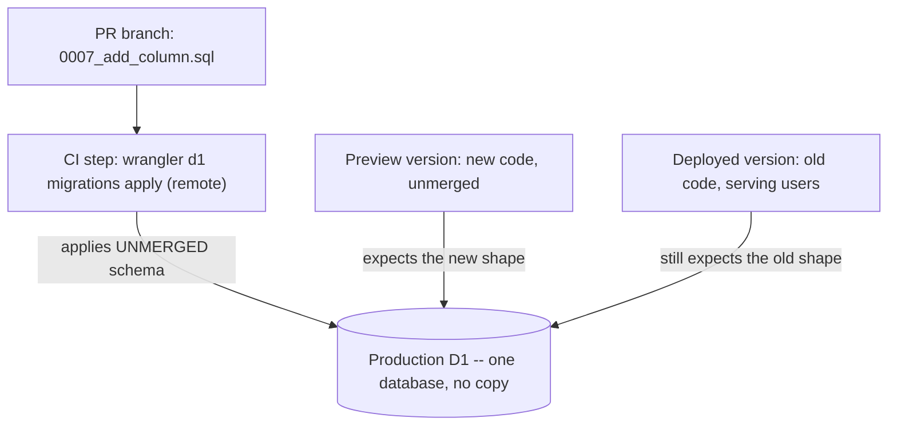

## 概要

プレビュー URL はステージング環境のように感じられるが、そうではない。プレビューバージョンとは**同じ Worker** の非アクティブなバージョンであり、[Cloudflare のバージョンとデプロイのドキュメント](https://developers.cloudflare.com/workers/versions-and-deployments/)によれば、バージョンが捕捉するのは「バンドルされたコード、静的アセット、バインディング、互換性設定」である。バインディングはそのまま引き継がれる。同じ D1 データベース、同じ KV 名前空間、同じ AI バインディング、そして同じ `SLACK_BOT_TOKEN` -- つまり同じ Slack ワークスペースであり、そのトークンが投稿できる本物のチャンネルそのものである。

プレビューには隔離された部分がひとつもない。この一点こそが、PR プレビューのワークフローにおけるデータベースマイグレーションを本番の問題にしている。ある本番リファレンス連携が、追加のみの DDL を慣習ではなく CI で強制するルールとして扱うに至ったのも、この理由による。

## ストレージの状態はバージョン管理されない

バージョン管理されるのはバインディングであって、その先にあるデータではない。Cloudflare はこれを明言している。

> KV、R2、Durable Objects、D1 といった関連する[ストレージリソース](https://developers.cloudflare.com/workers/platform/storage-options/)の状態変化は、バージョンとして追跡されない。

ここから 2 つの帰結が出てくる。どちらも実務で痛い目を見るものだ。

- プレビューバージョンは**生きている**行を読み書きする。コピーは存在しない。
- Worker のバージョンを戻しても、スキーマの変更は戻**らない**。コードは可逆だが、プレビューを動かすために適用したマイグレーションは可逆ではない。

## プレビューが必要とするもの、そしてその代償

プレビューは動いてこそ意味がある。PR がカラムを追加し、新しいコードがそれを select するなら、そのマイグレーションがプレビューのバインド先 -- すなわち本番のデータベース -- に適用されるまで、プレビューはエラーを返し続ける。そこで CI には、プレビューバージョンをアップロードする前に各 PR のマイグレーションを適用するステップが生える。

そのステップこそが問題のすべてであり、一文で言い表せる。**現在デプロイされている Worker が古いスキーマのままトラフィックを捌いている最中に、マージされていないスキーマ変更を本番 D1 へ適用している。**



「CI がマイグレーションを適用した」時点から「PR がマージされデプロイされた」時点までの窓は、数分のこともあれば数日のこともある。その間ずっと、生きている Worker は自分のために書かれていないスキーマの上で走り続ける。

## ルール: 追加のみの DDL

生きている Worker は、再デプロイされないまま、変更後のスキーマの上で動き続けなければならない。この要請は 1 つのルールに落ちる -- **追加だけをせよ**。

| 文 | マージ前に安全か | 理由 |
|---|---|---|
| `CREATE TABLE new_table (...)` | 安全 | 生きている Worker はその名前を一度も参照しない |
| `ALTER TABLE t ADD COLUMN c TEXT`（NULL 許容） | 安全 | 既存の `INSERT` も `SELECT` も有効なまま |
| `ALTER TABLE t ADD COLUMN c INTEGER NOT NULL DEFAULT 0` | 安全 | 既存行にはデフォルト値が入る |
| `CREATE INDEX ...` | 安全 | クエリ結果は変わらない |
| `DROP TABLE` / `ALTER TABLE ... DROP COLUMN` | 危険 | 生きている Worker がまだ読んでいる |
| カラムのリネーム、型変更 | 危険 | 生きている Worker から見ればリネームは削除と追加である |
| ガードのない `DELETE FROM` / `UPDATE` | 危険 | 本番の行をそのまま破壊する |

デフォルトなしの `NOT NULL` は、ここでは推奨されないどころか SQLite が拒否する。[SQLite の `ALTER TABLE` ドキュメント](https://www.sqlite.org/lang_altertable.html)によれば、`ADD COLUMN` で追加するカラムは、`NULL` でないデフォルトを持たないかぎり `NOT NULL` にできない。既存行に入れる値が存在しないからだ。

削除がなくなるわけではなく、**後回し**になるだけだ。古いカラムを読まなくなった Worker がすでにデプロイされたあとで、独立した PR として削除する。1 つ目の変更で追加してバックフィルし、次の変更で読むのをやめ、3 つ目で削除する。どの段階でも、古いコードと新しいコードの両方が動ける状態が保たれる。

:::warning[「安全」な追加カラムでも、生きている `SELECT *` は壊しうる]
追加のみの DDL が安全なのは、カラム名を明示しているコードに対してである。生きている Worker が `SELECT *` をして、その行を厳格なランタイムバリデーター -- 未知のキーを拒否するスキーマ -- に流し込んでいる場合、新しいカラムが現れた瞬間から、誰も何もデプロイしていないのに失敗し始める。このルールに頼る前に、クエリでカラム名を明示するか、バリデーターが余分なキーを許すようにしておくこと。
:::

## CI での強制

このルールは、機械的に検査する何かがあってはじめて成立する。レビュー時にはこの失敗が見えないからだ -- 差分は普通のマイグレーションにしか見えず、被害はマシンの上で起きる。

```sh
#!/usr/bin/env bash
# Fails the PR when a NEW migration file contains destructive SQL.
# Preview versions bind the production D1, so CI applies these before merge.
set -euo pipefail

pattern='DROP[[:space:]]+(TABLE|INDEX|VIEW)'
pattern="$pattern"'|ALTER[[:space:]]+TABLE[[:space:]]+[^[:space:]]+[[:space:]]+DROP'
pattern="$pattern"'|DELETE[[:space:]]+FROM'
pattern="$pattern"'|UPDATE[[:space:]]+[^[:space:]]+[[:space:]]+SET'

found=0
while IFS= read -r file; do
  [ -n "$file" ] || continue
  if grep -inE "$pattern" "$file"; then
    echo "  ^ destructive SQL in $file"
    found=1
  fi
done < <(git diff --name-only --diff-filter=A "$BASE_SHA...HEAD" -- 'migrations/*.sql')

if [ "$found" -eq 1 ]; then
  echo
  echo "Preview deploys apply migrations to PRODUCTION D1 before this PR merges."
  echo "Rewrite as additive-only DDL, or apply the override label."
  exit 1
fi
```

`UPDATE` と `DELETE` は、ガードの有無にかかわらず一律で引っかける。`WHERE` 句は動詞の 3 行下にあってもよいので、「ガードがない」かどうかは行単位のスキャンで判断できるものではない。判断するのは人間であり、その意思表示が下に述べるオーバーライドラベルである。

## オーバーライドラベルは「本番の破壊を受け入れる」という意味である

どうしても破壊的にならざるをえないマイグレーションはある。その脱出口は、人間が手で付ける GitHub のラベルとして用意する。CI が自分に付与できるものであってはならない。

```yaml
on:
  pull_request:
    # labeled / unlabeled are required here: without them, applying the
    # override label does not re-run this check, and the PR stays red.
    types: [opened, synchronize, reopened, labeled, unlabeled]

jobs:
  guard-migrations:
    runs-on: ubuntu-latest
    if: ${{ !contains(github.event.pull_request.labels.*.name, 'accept-production-break') }}
    steps:
      - uses: actions/checkout@v4
        with:
          fetch-depth: 0
      - run: ./scripts/check-migrations.sh
        env:
          BASE_SHA: ${{ github.event.pull_request.base.sha }}
```

ラベルの意味は、ラベルを定義した場所に、この言い方で書き残しておくこと。**このラベルを付けることは、この PR がマージされるまで続く本番の破壊を受け入れることを意味する。** この一文の前半と後半は対称ではない。停止状態はマージで終わるが、`DROP` や `DELETE` が消し去った行はマージしても戻ってこないし、Worker のバージョンを戻しても戻ってこない。

## 脱出口を使う前にバックアップを取る

オーバーライドラベルの前提条件は、先にエクスポートを取ってあることだ。[Cloudflare の D1 インポート / エクスポートのドキュメント](https://developers.cloudflare.com/d1/best-practices/import-export-data/)に従う。

```sh
npx wrangler d1 export <database_name> --remote --output=backup.sql
```

これをいつ実行するかは、ドキュメントに書かれた 2 つの制限が決める。「実行中のエクスポートは他のデータベースリクエストをブロックする」ため、障害対応の最中ではなく静かな時間帯に取ること。そして仮想テーブル（D1 の FTS5 全文検索テーブル）を含むデータベースはエクスポートに対応していないため、エクスポートの前後で削除と再作成が必要になる。

## 既定の道はローカル D1

上に書いたことのほとんどは、実のところ大半のマイグレーションには不要である。本物の SQLite スキーマに対して、本番を一切晒さずに検証できるからだ。

```sh
npx wrangler d1 migrations apply <database_name> --local
npx wrangler dev
```

マイグレーションファイルも、エンジンも、クエリも同じで、違うのはデータベースがローカルであることだけだ。[Cloudflare の D1 ローカル開発のドキュメント](https://developers.cloudflare.com/d1/best-practices/local-development/)も、違いはこのフラグだけだと明言している。曰く、「`--local` フラグを付けない場合、コマンドは Cloudflare のネットワーク上で動いているリモート版の D1 データベースに対して実行される」。本番プレビューを使う道を選ぶのは、検証したいものが本番のデータ量や本番の行そのものに関わるときだけでよい。

## つまずきどころ

- **`--local` を落とすと、黙って本番を対象にする。** それ以外はまったく同じコマンドで、確認プロンプトもなく、コマンドをスクリプトへコピーする過程でフラグは簡単に失われる。`--local` の付いていない `wrangler d1` の呼び出しは、すべて本番への書き込みだと思うこと。
- **プレビューが共有しているのはデータベースだけでなく Slack の bot トークンでもある。** プレビューバージョンがテスト投稿をすれば、それは本物のチャンネルへ、本物の人々の目の前に、本物の bot から投稿される。テスト投稿の宛先は設定で専用チャンネルへ向けること。プレビューが隔離されていることを期待して済ませてはいけない。
- **バージョンのロールバックはマイグレーションを取り消さない。** ストレージの状態はバージョンとして追跡されないため、ロールバックは古いスキーマを前提とするコードを復元しつつ、新しいスキーマをそのまま残す。ロールバック前の状態より厳密に悪くなることすらある。
- **同時に進む 2 つの PR が、同じマイグレーションファイル名を生成しうる。** 適用済みマイグレーションは `d1_migrations` テーブルに名前で記録されるため、両方の PR が同名の `0007_*.sql` を作った場合、先に適用されたほうが記録され、もう一方は適用済みとみなされて一度も実行されない。マイグレーションを生成する前にリベースし、番号は自分のブランチではなくベースブランチ上の最大値を見て決めること。
- **追加のみという制約がかかっているのは、PR ではなく*生きている* Worker のほうである。** どんなマイグレーションについても、問うべきは「新しいコードはまだ動くか」ではない。「いま本番で動いているコードはまだ動くか」である。
