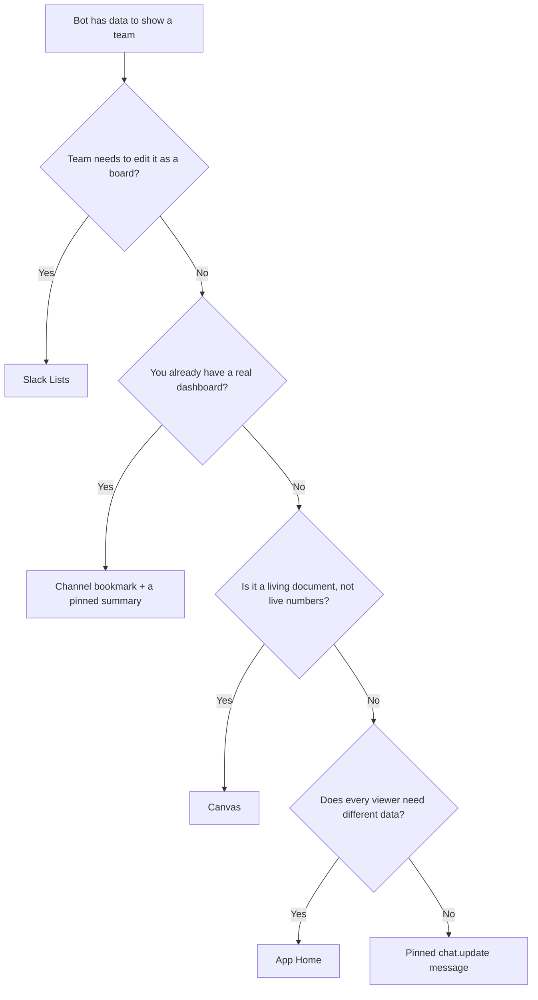

A bot has data to show a team -- a status board, a sync report, a set of tracked work items.
Slack gives you five different places to put it, and they are not interchangeable: each one
trades off who is allowed to edit it, how expensive it is to refresh, and how much visual
structure it can carry.

## Overview

| Surface | Bot-writable | Read-only guarantee | Refresh cost | Visual ceiling |
|---|---|---|---|---|
| Pinned `chat.update` message | Yes | Absolute -- only the posting app can edit it | 1 API call | Block Kit, incl. Table block |
| Slack Lists | Yes | Configurable, server-enforced, with holes | Per-row bookkeeping | A real Kanban board |
| Channel bookmark to an external dashboard | Yes | Governed by your own app | Zero -- always live | Unlimited -- it's your UI |
| Canvas | Yes | Configurable | 1 call, but a whole-document replace | Markdown document, tables only |
| App Home | Yes | Yes | O(users) calls per refresh | Full Block Kit, but per-user |

## Decision tree

## In This Section

- [Choosing a Dashboard Surface](./choosing-a-dashboard-surface.mdx) -- the ranked comparison
  across all five surfaces, with a decision rule
- [Canvas](./canvas.mdx) -- the `canvases.create` / `canvases.edit` write path, channel
  canvases, the `access.set` read flow, and hard limits
