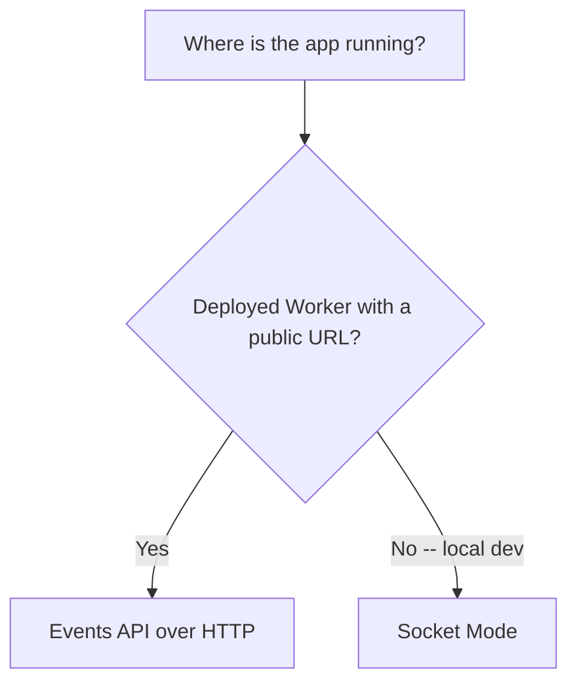

Slack pushes data to your app in two different shapes:

- **Events** -- things that happened in a workspace (a message was posted, a
  reaction was added, a channel was created). You subscribe per event type,
  gated by an OAuth scope.
- **Interactivity** -- a user acted on a Block Kit component your app
  rendered (clicked a button, picked an option). One payload per action.

In production, both arrive as a signed HTTP POST to a URL you register in
your app's settings (a Request URL for events, a separate Interactivity
Request URL for actions), and Worker-side handling is the same for both:
verify the signature, then acknowledge with a 2xx inside 3 seconds. See
[Verifying Requests](../worker-backend/verifying-requests.mdx) and
[The 3-Second Ack](../worker-backend/three-second-ack.mdx) for that shared
groundwork. Locally, the same two payload shapes can arrive over a WebSocket
instead -- see Socket Mode below -- but the payloads themselves don't
change, only the transport.

## Transport: Events API vs. Socket Mode

Slack offers two transports for events. Pick one per environment, not one for
the whole project.

| | Events API (HTTP) | Socket Mode (WebSocket) |
|---|---|---|
| Direction | Slack POSTs to your public URL | Your app opens a WebSocket to Slack |
| Needs a public URL | Yes | No |
| Fits a stateless Worker | Yes | No -- needs a persistent connection |
| Used here for | Production | Local development only |

## In This Section

- [Events API on Workers](./events-api-on-workers.mdx) -- the production
  path: the `url_verification` handshake, retries, event dedupe, and
  subscription scopes
- [Socket Mode for Local Dev](./socket-mode-local-dev.mdx) -- why Socket Mode
  doesn't fit a deployed Worker, and how to use it while iterating locally
- [Interactivity Payloads](./interactivity-payloads.mdx) -- `block_actions`
  payload anatomy and how to respond to one
