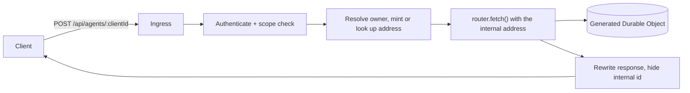

## Why This Page Exists

[Core Concepts and API](./core-concepts-and-api.mdx) records what the mounted conversation surface
does. This page records what an application has to build around it, because three things a
multi-tenant product needs are absent from Flue 2.0.3 by design: authentication, per-conversation
ownership, and deletion. The shape below was implemented against Flue 2.0.3 in
[zudolab/zudo-text#4621](https://github.com/zudolab/zudo-text/issues/4621); the Flue behaviors it
reacts to are verified facts, and the arrangement itself is a design proposal.

:::tip[Proposed contract]
The ingress, the conversation index, the delivery-credential table, and the deletion semantics on
this page are **application architecture authored by this site**. None of them is a Flue API. The
Flue behaviors that motivate each one are labeled separately as verified facts.
:::

## Do Not Mount the Router

The obvious arrangement is to mount `createAgentRouter(agent)` and put an authorization middleware
in front of it. That works, and it is what [Core Concepts and API](./core-concepts-and-api.mdx)
shows. The stronger arrangement is not to mount it at all.

`createAgentRouter(agent)` returns a plain Hono app, so `router.fetch(request, env, ctx)` drives it
directly with a request the application constructed. Nothing requires `app.route(mount, router)`.

The difference is what a mistake costs. A `/*` middleware in front of a mount is bypassable by a
routing error — a new route registered above it, a path that does not match the glob, a refactor
that reorders registration. A router with no mount is reachable only through paths the application's
own code builds, so there is no URL a client can discover that skips the checks.



Two consequences follow immediately from forwarding rather than mounting:

- **The admission response names the URL the router saw.** Its `streamUrl` field and `Location`
  header contain the *internal* conversation id. Rewrite both, or the client adopts the internal id
  as its next conversation name and opens a second conversation. Drop `Content-Length` when
  rewriting, since the new body is a different length.
- **`offset` and `submissionId` must pass through untouched.** They are the client's stream-resume
  and termination handles; rewriting them breaks both.

## Mint the Conversation Address Server-Side

:::note[Verified fact]
Conversation ids are caller-chosen path segments, and the mounted router applies no ownership check
of its own. An authenticated user reads another user's conversation by guessing its id.
:::

The client names a conversation; the server decides its address. Derive it from verified context
plus a random tail:

```
user:{userId}:vault:{vaultId}:conv:{clientConversationId}:{random}
```

and keep the mapping in an application-owned index (address, owner, created, last used). Guessing
another user's client-facing name is then harmless, because the guessed value is not the key.

The index is not optional bookkeeping. Flue offers no enumeration, so a conversation whose address
the application forgot is unreachable *and* un-erasable — there is no route that lists what exists.

## Keep Credentials Off the Delivery

:::danger[Verified fact: attributes are prompt text and permanent history]
`renderSignalMessage()` writes every signal attribute verbatim into the string that
`buildConversationContextEntries()` feeds to the model, and every delivery is an append-only record
replayed by `GET /:id?view=history`. There is no non-model-visible per-delivery channel in Flue
2.0.3. See [Core Concepts and API](./core-concepts-and-api.mdx#data-boundaries) for the full
verification.
:::

So a delivery carries identity, never secrets:

| Value | Channel | Why |
|---|---|---|
| `userId`, `vaultId` | `initialData` | Read with `useInitialData()`, never rendered into the prompt |
| Bearer token, key session id | Short-TTL row in application storage, keyed by conversation | Read by the tool at execution time, never in prompt or history |
| The user's actual request | Message body | It is prompt text, and that is what it is for |

The tool reads the credential row from **inside** the Durable Object. A module-scoped map in the
Worker does not work: tools execute in the generated Durable Object, which shares the Worker's
bindings but neither its isolate nor its request scope, so only shared storage or the message itself
crosses that boundary.

Two operational details make this safe rather than merely tidy. Give the credential row a short TTL,
and **delete it** when a request arrives without the credential rather than merely skipping the
write — otherwise a message sent after the user revoked access still rides the earlier grant, since
the row outlives one turn. And because the ingress stores the credential without validating it, an
expired session can only ever surface *mid-turn*, as a `tool-output-error` chunk, never as an error
on the send. Plan the client's recovery around that: re-prompt for consent and retry the turn.

## Own the Deletion, and Describe It Honestly

:::warning[Verified fact: nothing in Flue 2.0.3 deletes a conversation]
No router `DELETE`, no store delete, no enumeration, and on Cloudflare no runtime destroy for the
per-instance Durable Object SQLite. `POST /:id/abort` stops work and erases nothing.
:::

The random tail on the minted address is what makes an application-level delete meaningful. Deleting
the index row orphans the Durable Object stream, and the next message under the same client-facing
name mints a *different* address and therefore a new instance. Without the tail the delete would be
reversible: resending the same client name would resurrect the whole history.

Write the user-facing copy to match what actually happened. The conversation becomes unlisted and
unreachable immediately, and its bytes age out with the Durable Object. It was not permanently
erased, and a product that claims otherwise is making a promise the framework cannot keep.

## CORS: Necessary for Some Clients, Not All

`exposeHeaders` for `Stream-Next-Offset`, `Stream-Up-To-Date`, and `Location` is genuinely
load-bearing — but only for clients that read response *headers*. A browser SSE client resumes from
the `streamNextOffset` inside each `event: control` frame, which is response body, so it works with
a bare `Access-Control-Allow-Origin`. A long-poll or headless client reads the headers and breaks
without the configuration, silently, by reconnecting from a stale offset while the server looks
healthy. Configure it either way; just know which failure it prevents.

## What This Costs in Testability

:::note[Verified fact]
Flue's router and model loop run only inside a Flue-built Worker entry, not a plain Hono app under
Miniflare. No Vitest test can drive "send, tool call, reply" against the real model.
:::

Coverage therefore splits across three layers, and planning for that up front is cheaper than
discovering it late:

1. **Ingress HTTP contract**, with a fake router — authentication, ownership, quota, id rewriting,
   response rewriting, deletion.
2. **Tool execution**, with real tool factories against a fake backend — every tool's contract,
   including its failure sentences and thrown errors.
3. **Live evaluations**, credential-gated and run against a deployment — the only layer that proves
   the model actually calls the right tool.

The compensation is that layers 1 and 2 need no Miniflare-plus-Flue harness at all, because
`app.ts` imports cleanly without the plugin. Keep any `cloudflare:workers` import lazy and dynamic
if it is transitively reachable from `app.ts`, or the Node-hosted suite cannot load the module.

## Where the Boundaries Stay

Nothing here changes the boundaries on [Flue](./index.mdx): the conversation is not the canonical
store, the tool is not an authorization boundary, and the ingress re-authorizes every call rather
than trusting a conversation id it minted earlier. The ingress is one more application-owned
service, and it should be reviewed like one.
