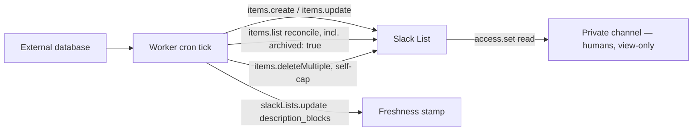

Every page in this section builds toward one design: a Cloudflare Worker cron mirrors rows from
an external database into a Slack List, a bot token is the **only** writer, and every human who
can see the list has read-only access. This page is the assembled pattern — the setup mechanics,
the rate math, and what "read-only" does and does not actually buy you.

The external database (or source table) stays the system of record for the whole pattern's
lifetime. The list is a pushed **view** over it, never the other way around — everything in
[Item Caps and Auto-Archive](./item-caps.mdx) exists because a list cannot safely hold a full,
ever-growing history.



## Mechanics checklist

### 1. The bot creates the list itself

Have the bot call `slackLists.create` rather than having a human create the list and share it
with the bot afterward. This resolves two problems at once:

- **You choose the option slugs.** Neutral ASCII values (e.g. `todo` / `doing` / `done`) under
  whatever display label you want — the value/label mismatch problem (chasing opaque
  `Opt…`-style slugs a human assigned) disappears entirely.
- **Access is implicit for the creator.** How a bot gets write access to a list it did **not**
  create is genuinely undocumented — `slackLists.access.set` accepts only `user_ids` or
  `channel_ids`, with no `app_ids` or bot argument anywhere in its signature. A creator has
  access to what it created; that is the only access route with no open question attached.

:::warning[Unverified]
Whether a bot can be granted write access to a list a *human* created — by passing the bot's
own user ID into `access.set`'s `user_ids`, or by sharing into a channel the bot belongs to — is
undocumented. One community report shows `list_not_found` from `items.update` despite a
channel share (a pre-GA, workflow-token context, so not fully conclusive for a modern `xoxb`
bot token). This project's verification spike, which would have settled it against a live
workspace, was skipped. **Do not plan around "human creates it, shares it with the bot" until
you have proven that path yourself with a throwaway call** — bot-creates-the-list sidesteps the
question entirely.
:::

### 2. Grant read access to the channel

One `slackLists.access.set` call, `access_level: "read"`, `channel_ids` pointing at a **private**
channel — see [Permissions and Ownership](./permissions.mdx) for why private (not public)
matters, and for the "Only you can share" setting to enable right after.

### 3. Persist `list_id`, every `column_id`, and every `row_id`

Nothing here is rediscoverable without an extra call — see
[Reading Lists](./reading-lists.mdx) for the `items.info` sentinel-row pattern that recovers
this mapping if it is ever lost:

- `list_id` and each written `column_id`, from the `slackLists.create` response.
- `row_id` per mirrored source row, from `slackLists.items.create` — persisted to your own
  database **atomically with the create call**, per
  [No Events, No Idempotency](./no-events-no-idempotency.mdx).

### 4. Cron tick: upsert by stored row id

Every source row you sync branches on whether it already carries a stored `row_id` —
`items.create` if not, `items.update` if so. This is the core idempotency mechanism covered in
full in [No Events, No Idempotency](./no-events-no-idempotency.mdx); this pattern page assumes
it and moves on to what wraps around it.

### 5. Freshness stamp via `description_blocks`

At the end of each successful sync, one `slackLists.update` call rewrites the list's description
to something like `Synced from <source> · 2026-08-06 14:32 · 187 rows`. This costs one call at
Tier 2, touches no rows, and has zero cap impact — a far cheaper freshness signal than a
per-row "last synced" column, which would cost N writes per sync and make every row look
changed to anyone diffing `updated_by`.

```typescript
// NOTE: the argument is `id`, not `list_id` — the one method in the
// 12-method surface that names this argument differently from every
// items.* method, which all use `list_id`.
export async function stampFreshness(
  botToken: string,
  listId: string,
  sourceName: string,
  rowCount: number,
): Promise<void> {
  const timestamp = new Date().toISOString();
  await fetch("https://slack.com/api/slackLists.update", {
    method: "POST",
    headers: {
      authorization: `Bearer ${botToken}`,
      "content-type": "application/json; charset=utf-8",
    },
    body: JSON.stringify({
      id: listId,
      description_blocks: [
        {
          type: "rich_text",
          elements: [
            {
              type: "rich_text_section",
              elements: [
                { type: "text", text: `Synced from ${sourceName} · ${timestamp} · ${rowCount} rows` },
              ],
            },
          ],
        },
      ],
    }),
  });
}
```

### 6. Periodic reconcile, including the archived pass

An infrequent full pass — paginate `items.list`, diff against your database, then run the same
pass again with `archived: true`. See
[No Events, No Idempotency](./no-events-no-idempotency.mdx) for the full mechanics and why the
second pass is the only way to see what auto-archive removed.

### 7. Self-cap with explicit deletes

Evict your own oldest rows with `items.deleteMultiple` well before the real per-list cap, rather
than depending on Slack's reported (and unverified) auto-archive behavior. See
[Item Caps and Auto-Archive](./item-caps.mdx) for the full policy and a copy-pasteable eviction
helper.

### The one manual step: board setup

Board layout, the group-by column, and the default view are UI-only and owner-configured — see
[Board Layout](./board-layout.mdx). A human does this once, by hand, using the ownership
topology from [Permissions and Ownership](./permissions.mdx) (the bot promotes a human to owner,
or a human creates and configures the list and grants the bot write access instead). This is a
one-time setup cost, not part of the cron tick.

## Rate math for a mirror

Take a mirror self-capped at 300 active rows (see
[Item Caps and Auto-Archive](./item-caps.mdx) for why to stay well under the 1,000-row ceiling).

| Operation | Frequency | Calls | Tier | Rough cost |
|---|---|---|---|---|
| Initial backfill (300 rows, `items.create`) | once | 300 (one call per row) | 2 or 3 — contested, assume the stricter Tier 2 (20+/min) | ~15 min |
| Steady-state update (worst case: one call per changed row, `items.update`) | per cron tick | up to 300 | Tier 3 (50+/min) | ~6 min for a full-batch resync |
| Reconcile pass (`items.list`, paginated) | per cron tick or less often | ~3 (300 rows ÷ ~100/page) | Tier 2 (20+/min) | seconds |
| Freshness stamp (`slackLists.update`) | once per successful sync | 1 | not stated in the source research | negligible |

:::warning[Unverified]
The steady-state row is a worst case on purpose. Because `row_id` lives inside each `cells[]`
entry rather than at the top level of `items.update`, one call *could* structurally carry cells
for many different rows in a single request — but every documented sample shows exactly one
cell for one row, and no page states multi-row batching either works or is supported. This is
the single highest-leverage unknown in the whole pattern: it is the difference between a
~5-second and a ~6-minute sync for a few hundred changed rows. This project's spike, which would
have tested a real multi-row `cells[]` payload against a live list, was skipped. **Test this
empirically before finalizing a design that depends on batching**, and regardless of the answer,
guard the cron handler against overlapping its own next tick with a run lock or lease — see
[No Events, No Idempotency](./no-events-no-idempotency.mdx).

Separately, `items.create`'s rate tier is itself contested between two Slack-official sources
(docs say Tier 2, the Java SDK's machine-readable rate-limit metadata says Tier 3) — assume the
stricter Tier 2 when sizing a backfill, as the table above does.
:::

## What read-only does not give you

Granting `read` access is a real, server-enforced restriction — but it is not a silence
guarantee, and it is not absolute:

- **Viewers can still read and post comments** in item threads. A "read-only" board can still
  generate discussion; it just cannot be edited directly.
- **Owners and admins can delete the entire list at any time**, regardless of what access level
  anyone else holds. No ACL configuration prevents an admin override.
- **A published Form workflow bypasses access levels entirely** — publish none on a mirrored
  list.

See [Permissions and Ownership](./permissions.mdx) for the full list of five holes and the
ownership topologies this pattern depends on.

## Setup checklist

1. Confirm the workspace is on a paid plan (Pro or above) and Lists has not been disabled by an
   admin.
2. Add `lists:read` and `lists:write` scopes to the app and reinstall (adding scopes forces a
   reinstall).
3. Pick an ownership topology (see [Permissions and Ownership](./permissions.mdx)); exactly one
   human ends up holding write either way — record their name in your runbook.
4. Share the list into a **private** channel with `access_level: "read"`.
5. Turn on **"Only you can share"** (Share → Advanced settings) so read access cannot spread
   beyond who you granted it to.
6. Publish **no Form workflow** on the list, and leave field-change notifications off until
   tested — whether API-originated writes (as opposed to human edits) trigger "notify when
   field changes" automations is undocumented; a cron rewriting cells every tick could firehose
   the channel if that turns out to be true.
7. Accept, going in, that admins can delete the board at any time and that viewers can comment
   in item threads — neither is a defect in your setup, both are how Lists work.

## Related

- [Reading Lists](./reading-lists.mdx)
- [No Events, No Idempotency](./no-events-no-idempotency.mdx)
- [Item Caps and Auto-Archive](./item-caps.mdx)
- [Permissions and Ownership](./permissions.mdx)
- [Board Layout](./board-layout.mdx)
