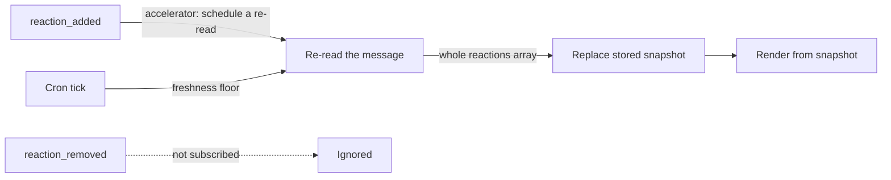

Reactions are two unrelated things to a bot. **Read**, they are the cheapest signal a channel
produces — a vote, an acknowledgement, a triage decision, already attached to the message it
applies to, costing the human one click and no training. **Written**, they are a place to put a
small amount of durable state where every human in the channel sees it without opening anything.
Both directions have sharp edges, and they are different sharp edges — as does the
`reaction_added` event stream that connects the two.

## Adding a Reaction

### The Parameter Is `timestamp`, Not `ts`

`reactions.add` takes `channel`, `name` (the emoji name, no surrounding colons), and `timestamp` —
the `ts` of the message being reacted to
([`reactions.add`](https://docs.slack.dev/reference/methods/reactions.add/)). That third name is
the trap. Message objects carry this value as `ts`. `conversations.history` and
`conversations.replies` return it as `ts`. `chat.update` takes it as `ts`. `reactions.add` takes
it as `timestamp` — and so do `reactions.get` and `reactions.remove`. The naming is consistent
*within* the `reactions.*` family and inconsistent *across* families, which is exactly the shape
that survives code review.

The failure mode is silent in the way that matters. Spreading a param object that already carries
`ts` into a `reactions.add` call sends no timestamp at all, and the response complains about the
item rather than about a field name — so it reads like "that message doesn't exist," not like "you
spelled the parameter differently over here." Rename at the boundary, in one wrapper, and never
hand-write the call twice.

### `already_reacted` Is an Idempotent Success

Calling `reactions.add` for an emoji the token's identity has already added to that message
returns `ok: false` with `error: "already_reacted"`. It is an error in shape only — the state the
caller asked for (that reaction, by that identity, on that message) already holds. Treating that
one error code as success is what turns a bot reaction into a safely retryable side effect:

```typescript
export async function markMessage(
  botToken: string,
  channel: string,
  messageTs: string,
  name: string,
): Promise<void> {
  const res = await fetch("https://slack.com/api/reactions.add", {
    method: "POST",
    headers: {
      authorization: `Bearer ${botToken}`,
      "content-type": "application/json; charset=utf-8",
    },
    // `timestamp`, not `ts` — reactions.* names this parameter differently
    // from conversations.history / conversations.replies / chat.update.
    body: JSON.stringify({ channel, timestamp: messageTs, name }),
  });
  const body = (await res.json()) as { ok: boolean; error?: string };

  // The marker is already there, which is the postcondition this call wanted.
  if (!body.ok && body.error !== "already_reacted") {
    throw new Error(`reactions.add failed: ${body.error}`);
  }
}
```

That single branch is what lets the call sit anywhere a duplicate delivery is possible: inside an
Events API handler Slack may retry three times, inside a cron pass that re-scans a window it has
already scanned, inside a queue consumer with at-least-once semantics. Without it, every duplicate
becomes a logged failure, and a retry wrapper that treats any `ok: false` as "try again later"
spends its whole budget on a call whose outcome can never change.

### A Bot's Emoji as a Durable State Marker

Once the call is idempotent, the bot's own reaction becomes a state field with properties a
database row does not have: it renders exactly where the fact applies, needs no UI to read, needs
no query to answer "did this get handled," and survives the bot's own storage being rebuilt. A
production reference integration uses precisely this as its ingest marker — a check mark the bot
adds to a source message the moment that message has been processed.

A small vocabulary goes a long way:

| Marker | Means |
|---|---|
| `:eyes:` | picked up, work in flight |
| `:white_check_mark:` | processed successfully |
| `:warning:` | tried and failed — details in the thread |

Keep the vocabulary short and keep the detail in a threaded reply. The reaction answers "what
state is this in"; the thread answers "why."

### A Bot's Reaction Is Effectively Irreversible

Slack scopes reaction removal to the identity that added it. `reactions.remove` removes the
authenticated identity's own reaction, and clicking a reaction pill in the client toggles only
your own. There is no API for removing someone else's reaction, and no admin override that grants
one.

For a bot marker that means the only thing in the workspace that can take it off is the bot
itself, calling `reactions.remove` with the same token — not the person who triggered the work,
not the channel owner, not a workspace admin. Unless the app deliberately ships an un-mark path,
every marker it adds is permanent from every human's point of view.

That makes each `reactions.add` a product decision rather than an implementation detail:

- **Document it as one-way** wherever users learn what the bot does. "The bot marks it and nobody
  can unmark it" is a surprising rule, and it is far cheaper to state up front than to discover.
- **Don't encode state that legitimately flips back and forth.** A marker that has to come off
  again belongs in a thread reply or a `chat.update`-refreshed message body, not in a reaction.
- **If reversal is a real requirement, build it.** An explicit app action — a slash command, a
  button — calling `reactions.remove` under the bot token is the only mechanism that exists.

This is a fixed part of Slack's reaction model, not a gap a future release will close. Design
around it instead of waiting it out.

## Reading Reaction State

`conversations.history` and `conversations.replies` return each message with a `reactions` array.
That array is not a tally. Three separate things make a naive read of it wrong, and a realistic
payload shows all three at once:

```json
"reactions": [
  { "name": "+1", "count": 3, "users": ["U01", "U02", "U03"] },
  { "name": "+1::skin-tone-3", "count": 1, "users": ["U04"] },
  { "name": "thumbsup", "count": 1, "users": ["U01"] },
  { "name": "eyes", "count": 42, "users": ["U01", "U02", "U03", "U04", "U05"] }
]
```

### Skin-Tone Variants Arrive as Separate Entries

A reader who picked a skin tone in their Slack preferences sends `+1::skin-tone-3`, not `+1`, and
that lands as its own entry with its own `count` and `users`. The suffix is a rendering modifier
(`::skin-tone-2` through `::skin-tone-6`; the default yellow carries no suffix), not a different
reaction — nobody in the channel reads the two pills as expressing different things.

Strip the suffix, then merge the entries that collapse onto the same base name: union the user
sets, and dedupe rather than assume disjointness, because the same person can end up in two
variant entries after changing their skin-tone preference between clicks.

### Alias Pairs Are Two Names for One Meaning

`+1` and `thumbsup` are the same emoji under two names, as are `-1` and `thumbsdown`. Which name
arrives depends on how the reaction was added, so both can appear on one message — and in the
payload above, `U01` appears under both. Naive count-summing across the whole `+1` family —
aliases and skin-tone variants together — reports 3 + 1 + 1 = **5** approvals, when the distinct
people are `U01`, `U02`, `U03`, and `U04`: **4**.

Two consequences. Any table that maps emoji to meaning has to match on *every* name for that
meaning, not just the one someone happened to write in the config. And any count that merges
aliases has to dedupe by user id, because the summed `count` values will double-count anyone who
used both.

### `count` Is Authoritative; `users[]` Is Not

On a heavily-reacted message, `users` is truncated while `count` keeps reporting the true total —
the `eyes` entry above says 42 with five ids listed. **Never derive a count from `users.length`.**
The truncation point is not a number to hard-code against; treat any entry where
`users.length < count` as truncated and carry on.

The shape that survives this is two numbers instead of one: a total from `count`, and a known set
from `users`. Render the difference as "+N" — "5 known, +37 more" is honest, where "5" is a bug
and "42 named users" is a lie.

Merging variants and aliases interacts with truncation in one way worth naming: the union of
`users` is exact only when no merged entry was truncated. When one was, the summed `count` is an
upper bound (it may double-count a user across an alias or variant) and the union is a lower
bound. Keep both, and say which one a rendered number came from:

```typescript
const SKIN_TONE = /::skin-tone-[2-6]$/;

// Alias pairs are distinct API names for one emoji; map every name to one key.
const ALIASES: Record<string, string> = {
  thumbsup: "+1",
  thumbsdown: "-1",
};

export function canonicalReactionName(name: string): string {
  const base = name.replace(SKIN_TONE, "");
  return ALIASES[base] ?? base;
}

type SlackReaction = { name: string; count: number; users?: string[] };

export type ReactionTally = {
  name: string;
  totalCount: number; // summed `count` — authoritative per entry, upper bound once merged
  knownUsers: Set<string>; // deduped across variants and aliases; lower bound if truncated
  truncated: boolean;
};

export function tallyReactions(reactions: SlackReaction[] = []): Map<string, ReactionTally> {
  const byName = new Map<string, ReactionTally>();

  for (const reaction of reactions) {
    const key = canonicalReactionName(reaction.name);
    const tally = byName.get(key) ?? {
      name: key,
      totalCount: 0,
      knownUsers: new Set<string>(),
      truncated: false,
    };

    tally.totalCount += reaction.count;
    for (const user of reaction.users ?? []) tally.knownUsers.add(user);
    // `users` is capped on busy messages; `count` is the number to trust.
    if ((reaction.users?.length ?? 0) < reaction.count) tally.truncated = true;

    byName.set(key, tally);
  }

  return byName;
}
```

:::tip[A targeted read for one message's reactions]
Paginating `conversations.history` to reach one known message is wasteful when the message id is
already in hand. `conversations.history` accepts `latest: <ts>` with `inclusive: true` and
`limit: 1` to fetch exactly that message, and
[`reactions.get`](https://docs.slack.dev/reference/methods/reactions.get/) reads an item's
reactions directly — it takes `channel` + `timestamp` (the same naming as `reactions.add`), and
its reference page documents a `full` flag for returning the complete reaction list. Whichever one
you call, keep trusting `count` over `users.length`; the rule costs nothing and holds everywhere.
:::

### Thread Replies Carry Their Own Reactions

A reaction on a thread reply attaches to that reply's own `ts`. It never appears in the parent
message's `reactions` array, and the parent's reactions never appear on a reply. The two scopes
are simply different messages that happen to be visually nested.

That makes the read method part of the answer: `conversations.history` returns top-level messages,
so it sees only the parent's reactions; `conversations.replies` returns the parent plus its
replies, so it is the call that can see both. A feature that reports "5 people approved" must
therefore state which scope it counted — parent only, or parent plus replies. Two integrations
reading the same thread with different scopes produce different numbers from identical data, and
neither of them is wrong.

## Consuming `reaction_added` Events

Subscribing to [`reaction_added`](https://docs.slack.dev/reference/events/reaction_added/) (scope
`reactions:read`) turns reactions into a push signal:

```json
{
  "type": "reaction_added",
  "user": "U024BE7LH",
  "reaction": "white_check_mark",
  "item_user": "U0G9QF9C6",
  "item": { "type": "message", "channel": "C0G9QF9GZ", "ts": "1360782400.498405" },
  "event_ts": "1360782804.083113"
}
```

### Filter Before Acting

Three checks, in this order, before an event is allowed to do anything:

```typescript
type ReactionAddedEvent = {
  type: "reaction_added";
  user: string;
  reaction: string;
  // A file item carries no `channel` / `ts` — read them only after the type check.
  item: { type: string; channel?: string; ts?: string };
  event_ts: string;
};

export function shouldHandle(
  event: ReactionAddedEvent,
  botUserId: string,
  watchedChannels: ReadonlySet<string>,
): boolean {
  if (event.item.type !== "message") return false;
  if (!event.item.channel || !watchedChannels.has(event.item.channel)) return false;
  if (event.user === botUserId) return false; // the app's own reactions.add calls
  return true;
}
```

1. **`event.item.type` is not always `message`.** Reactions on files arrive through the same
   subscription, and a file item has no `channel` and no message `ts` at all. Code that reaches
   for `event.item.channel` before checking the type is one emoji on an uploaded screenshot away
   from an undefined channel id flowing into a Web API call.
2. **Check the channel.** The subscription delivers every channel the app can see, not the one
   channel a given feature cares about. Match against an explicit set rather than assuming.
3. **Drop the app's own reactions.** Every `reactions.add` the app makes comes back to it as a
   `reaction_added` event. Unlike message events there is no `bot_id` field to test here — the
   only discriminator is `event.user` against the app's own bot user id, which comes from
   `auth.test` (`user_id`). Fetch it once at startup and cache it; do not call `auth.test` per
   event. Skip this check and a bot that reacts in response to a reaction re-triggers itself.

### Event Identity Is Not Fact Identity

Deduping on the envelope's `event_id` is the standard Events API guard, and it is necessary —
Slack retries a delivery up to three times. But it protects against *the same delivery arriving
twice*, and nothing more.

Remove a reaction and add it again — same person, same emoji, same message — and Slack mints a
brand-new `event_id`. To the ledger that is a new event, so a non-idempotent handler runs a second
time, and anyone can trigger it by double-clicking a reaction pill.

Key the side effect on the fact rather than on the delivery: `(channel, message ts, reaction name,
reacting user)`, or just `(channel, message ts)` for a "the first check mark closes this" rule.
Keep the `event_id` ledger for delivery dedupe and add the fact key for the action — the two
guards answer different questions and you want both.

### Replace-on-Read Is the Robust Consumption Pattern

The pattern that holds up in production inverts the usual event-sourcing instinct. Do not apply
event deltas to a stored tally. Instead, periodically re-read the message's full `reactions` array
and **replace** the stored snapshot wholesale, treating events as a low-latency accelerator that
schedules a re-read sooner:



Do not subscribe to `reaction_removed` at all. Three failure modes disappear as a consequence of
the replace step rather than as features you have to build:

| Failure | Why it self-heals |
|---|---|
| Removal | The next re-read simply does not see the reaction; no removal event needed |
| Missed or dropped delivery | Costs freshness until the next poll, never correctness |
| Out-of-order delivery | No deltas are applied, so there is no order to get wrong |

The price is staleness between polls, bounded by the polling interval — pick that interval from
how stale the rendered state is allowed to be, and let events pull it in when they arrive. Note
that non-Marketplace apps have `conversations.history` and `conversations.replies` cut to one
request per minute returning at most 15 objects, which makes a re-read per event a non-starter for
those apps: coalesce the nudges and re-read on a batched sweep instead.
