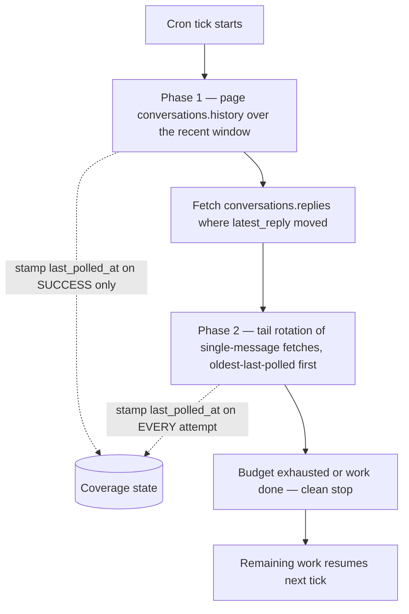

A bot does not need the Events API to know what happened in a channel. `conversations.history`
and `conversations.replies` can be polled on a cron as a **read model**: each tick pulls the
current state of some window of messages, and local storage is rewritten to match what came back.
A production reference integration runs exactly this way and has sustained it against the reduced
non-Marketplace ceiling of roughly one request per minute — a constraint that shapes every
mechanic on this page. See [Rate Limits](./rate-limits.mdx) for the full non-Marketplace regime,
its rollout timeline, and how that one-request-per-minute ceiling came about.

Polling here is not a consolation prize for "we couldn't get events working." Under a rate
ceiling that tight, it is the design that degrades gracefully: a tick that runs out of budget
stops cleanly and the next one picks up where it left off, and no delivery is ever lost because
nothing is ever delivered — the state is simply read again.

## One Sweep Carries Reaction and Thread State Inline

Every message object `conversations.history` returns already carries the state an integration
would otherwise chase with per-message calls:

| Field | What it gives you |
|---|---|
| `reactions[]` | Each emoji on the message — `name`, `count`, and the `users` who reacted |
| `reply_count` | How many replies the thread holds (absent when the message has no thread) |
| `latest_reply` | The `ts` of the newest reply in the thread |

```json
{
  "type": "message",
  "ts": "1754467200.123456",
  "user": "U01234567",
  "text": "Deploy finished",
  "reactions": [
    { "name": "white_check_mark", "users": ["U01234567", "U07654321"], "count": 2 },
    { "name": "eyes", "users": ["U07654321"], "count": 1 }
  ],
  "reply_count": 3,
  "latest_reply": "1754470800.000200"
}
```

One page of history is therefore a **bulk reaction read**: reaction state for hundreds of
messages at the cost of a single call. `reactions.get` exists, but it answers for one message at a
time, and at roughly one request per minute a per-message call pattern is not affordable at any
useful scale. See [Reactions](./reactions.mdx) for what this `reactions[]` array does and does not
tell you — skin-tone variants, alias pairs, and the truncated `users[]` list all apply here too.

A message with no reactions omits the `reactions` key entirely rather than sending an empty array.
Read that as "zero reactions" — which is exactly the state to write — because it is also how an
**un-reaction** shows up: the emoji someone removed is simply no longer in the list, and the last
one removed takes the whole key with it. That is the first place the replace-on-read contract at
the bottom of this page earns its keep.

## `latest_reply` Is the Thread-Change Watermark

`reply_count` alone cannot tell you a thread changed — a reply added and another deleted leaves it
identical. `latest_reply` can: store it per thread and fetch `conversations.replies` only for
threads whose value moved past what you have.

```typescript
for (const message of historyPage.messages) {
  if (!message.reply_count) continue;
  const watermark = storedWatermarks.get(message.ts);
  // Slack timestamps are fixed-width ("1754467200.123456"), so lexical
  // comparison and numeric comparison agree.
  if (watermark && watermark >= message.latest_reply) continue;
  await syncThread(channelId, message.ts, message.latest_reply);
}
```

The ordering inside `syncThread` is the part that is easy to get backwards. **Write the watermark
only after the replies write has succeeded.**

```typescript
async function syncThread(
  channelId: string,
  parentTs: string,
  latestReply: string,
): Promise<void> {
  const replies = await fetchAllReplies(channelId, parentTs);
  await db.replaceThreadReplies(channelId, parentTs, replies);
  // Watermark LAST. If either step above throws, the stored watermark still
  // trails latest_reply, so the next tick sees this thread as changed and
  // retries it. Stamping first would mark the thread current and drop it
  // until some future reply happens to arrive.
  await db.setThreadWatermark(channelId, parentTs, latestReply);
}
```

Failure keeps the thread eligible. That is the whole trick — a watermark written optimistically is
a silent, permanent hole in the data for every thread whose sync happened to fail.

## Fetching Exactly One Message

There is no `conversations.getMessage`. The single-message read is `conversations.history` with
`oldest` and `latest` set to the same timestamp:

```typescript
const res = await callSlackApi<{ messages: SlackMessage[] }>("conversations.history", {
  channel: channelId,
  oldest: ts,
  latest: ts,
  inclusive: true,
  limit: 1,
});
const message = res.messages[0]; // undefined when the message is no longer there
```

`inclusive: true` is required — without it the bounds are exclusive and the window contains
nothing.

:::warning[A deleted message comes back absent, not flagged]
Ask for a message that has been deleted and the response is `ok: true` with an empty `messages`
array. There is no `deleted: true` marker, no error code, and nothing to catch. The only correct
reading of an empty result is **"this pass learned nothing about that message"** — leave the
stored row exactly as it is.

Clearing local state on an empty result turns every transient invisibility into permanent data
loss, and the same empty array is what you get for a message the bot can no longer see for
reasons that have nothing to do with deletion. Skip, do not clear.
:::

## Page Sizes: 999 for History, 1000 for Replies

The two methods do not share a maximum page size, and a single shared constant is wrong in one
direction or the other — either it exceeds what `conversations.history` documents, or it leaves
every reply page one item short.

| Method | Documented maximum `limit` |
|---|---|
| [`conversations.history`](https://docs.slack.dev/reference/methods/conversations.history/) | 999 |
| [`conversations.replies`](https://docs.slack.dev/reference/methods/conversations.replies/) | 1000 |

```typescript
const HISTORY_PAGE_LIMIT = 999;
const REPLIES_PAGE_LIMIT = 1000;
```

Both paginate by cursor, and the end condition is an **empty string**, not a missing key:
`response_metadata.next_cursor` is present on the last page with `""` as its value. Terminate on
truthiness, not on `undefined`.

```typescript
async function fetchAllReplies(channelId: string, parentTs: string): Promise<SlackMessage[]> {
  const messages: SlackMessage[] = [];
  let cursor: string | undefined;
  do {
    const res = await callSlackApi<{
      messages: SlackMessage[];
      response_metadata?: { next_cursor?: string };
    }>("conversations.replies", {
      channel: channelId,
      ts: parentTs,
      limit: REPLIES_PAGE_LIMIT,
      ...(cursor ? { cursor } : {}),
    });
    messages.push(...res.messages);
    // Empty string, not undefined, is how the last page signals the end.
    cursor = res.response_metadata?.next_cursor || undefined;
  } while (cursor);
  return messages;
}
```

:::note[The limit you send is a ceiling, not a promise]
Under the reduced non-Marketplace limits, these methods return far fewer objects per response than
the documented maxima above regardless of what `limit` you send. Never infer "that was the last
page" from a short response — a short page with a non-empty `next_cursor` is completely normal,
and only the cursor tells you when to stop.
:::

## `conversations.replies` Includes the Parent

The array `conversations.replies` returns starts with the **parent message itself**, not with the
first reply. Exclude it by timestamp before anything downstream touches the list:

```typescript
const replies = allFromRepliesCall.filter((m) => m.ts !== parentTs);
```

Forget this and the parent is processed twice — once from the history sweep and once from the
thread fetch — so its reactions are double-counted and a thread with no replies at all reports
one.

## Bot Self-Detection: `bot_id` First, `subtype` as Fallback

**`bot_id` is the primary signal that a message came from an app.** A message posted by
`chat.postMessage` with a modern granular-permissions token comes back carrying `bot_id` and
**no `subtype` at all**.

The consequence is specific and easy to miss: a filter written against
`subtype === "bot_message"` does not match the app's own posts. The app ingests its own output —
and on any integration that reacts to what it reads, that closes a feedback loop.

```typescript
// bot_id is primary. subtype === "bot_message" only appears for classic
// tokens and a few legacy paths, so it is a fallback, never the test.
function isAppPost(message: SlackMessage, ownBotId: string): boolean {
  if (message.bot_id) return message.bot_id === ownBotId;
  return message.subtype === "bot_message";
}
```

The app's own `bot_id` comes from `auth.test` — resolve it once at startup and cache it, rather
than treating every bot-authored message in the channel as the app's own.

This applies to reads, not only to events. A codebase that gets bot filtering right in its Events
handler very often has a second, weaker copy of the same check in the polling path, written
against `subtype` because that is what the Events API examples show.

## Budgets Under Throttling

At roughly one request per minute, with `Retry-After` waits that can legitimately run about a
minute each, a tick's wall-clock cost is dominated by waiting rather than by work. Two different
kinds of limit are needed, and they behave differently.

```typescript
const BUDGET = {
  historyPages: 8, // hard cap — conversations.history calls
  repliesCalls: 12, // hard cap — conversations.replies calls
  usersInfoCalls: 20, // hard cap — users.info calls
  tailFetches: 25, // hard cap — single-message fetches in the tail rotation
  softDeadlineMs: 4 * 60 * 1000, // soft — checked BETWEEN calls only
};
```

**Hard caps** are per-call-class counters — history pages, replies calls, `users.info` calls —
decremented as calls are spent and checked before the next one starts. They bound the tick's cost
in requests, which is the quantity the rate limit actually meters.

**The wall-clock deadline is soft, and is evaluated only between calls.** Never mid-call, and
never as a timeout that aborts a request in flight: a single legitimate `Retry-After` wait can be
around 60 seconds, and cancelling it throws away both the wait already served and the call that
was about to succeed. Check the clock at the loop boundary; let every started call finish.

```typescript
function canContinue(spent: Spend, startedAt: number): boolean {
  if (spent.historyPages >= BUDGET.historyPages) return false;
  if (Date.now() - startedAt >= BUDGET.softDeadlineMs) return false;
  return true;
}
```

Budget exhaustion is a **clean stop, not an error**. The tick returns normally, having committed
everything it did fetch, and the remaining work is picked up next tick because the coverage state
below already records what was and was not polled. Throwing on exhaustion discards work that
already succeeded and makes "did this tick succeed?" a question with no useful answer.

## Two-Phase Coverage: Bulk Window Plus Tail Rotation

No single strategy covers both "what just changed" and "everything still being tracked" inside one
tick's budget. Two phases do.



**Phase 1, bulk.** Page `conversations.history` backwards over a recent window, stopping at the
window boundary or the history-page budget, whichever comes first. This is what catches new
messages, new reactions, and moved `latest_reply` watermarks in bulk.

**Phase 2, tail rotation.** Tracked messages older than the bulk window get individual
single-message fetches, using the `oldest === latest` idiom above. Selection is a rotation ordered
by when each item was last polled, with never-polled items ahead of everything else:

```typescript
const tail = await db.query(
  `SELECT channel_id, ts
     FROM tracked_messages
    WHERE ts < ?
    ORDER BY last_polled_at ASC NULLS FIRST
    LIMIT ?`,
  [bulkWindowStart, BUDGET.tailFetches],
);
```

:::warning[The stamping rule is asymmetric on purpose]
- The **bulk phase** stamps `last_polled_at` only on **success**.
- The **tail rotation** stamps `last_polled_at` on **every attempt, including failures**.

Give the tail the bulk phase's success-only rule and a single permanently failing item — a message
in a channel the bot was removed from, a row with a timestamp that no longer resolves — parks
itself at the head of `ORDER BY last_polled_at ASC NULLS FIRST` forever. Every tick selects it,
fails on it, declines to stamp it, and selects it again next tick. The rotation stops advancing
and everything behind it starves indefinitely.

Stamping the attempt costs exactly one thing: a failed poll delays that item by one full rotation.
It buys the guarantee that the rotation always moves.
:::

The bulk phase can afford success-only stamping because it is not a rotation — it re-derives its
window from the wall clock on every tick, so a failed page is simply covered again next time
without holding anything else back.

## Replace-on-Read: Why Polling Needs No Dedupe Ledger

Everything above depends on one contract governing writes. Five rules, none of them optional:

1. **Write state only for messages actually fetched this pass.** Anything not read this pass keeps
   whatever it already had.
2. **Replace whole per-item state.** The reaction set, the reply set, the text — overwrite them,
   never merge into them.
3. **A fetch that runs out of budget writes nothing.** No partial reply set, no advanced cursor,
   no half-applied thread.
4. **Absent means skip, never clear** — the deleted-message rule from above.
5. **A typed per-item error skips that item and the sweep continues.** One unreadable message must
   not abort a tick that has hundreds of readable ones left.

This is why a polling read model needs **no per-event dedupe ledger**. An events-driven ingest has
to answer "have I already applied this delivery?" for every payload, because Slack retries and
duplicates them, and applying a delta twice corrupts state. A read model never asks that question:
it does not apply deltas at all, it overwrites current state with what the API just said. An
un-reaction resolves because the replacement set simply lacks that emoji. An edit resolves because
the replacement text is the new text. A missed event, a duplicated event, a retried tick, and a
tick that died halfway all resolve identically — **next read wins**.

That guarantee is only as strong as rule 3. Partial writes are precisely what turn "next read
wins" into "next read wins over whatever half-state the last crash left behind": a thread whose
replies were written partway and whose cursor advanced anyway is indistinguishable from a thread
that legitimately shrank, and no later read can tell the difference.

## Identity: `(channel, ts)` Is the Only Join Key

Slack has no way to answer "which message did I post for record 42." The `channel` and `ts` pair
returned by `chat.postMessage` is the **only** link back from a Slack message to the source record
it represents — persist the pair at post time, in the same transaction that records the post. Lose
it and everything a sweep reads afterwards has nothing to attach to.

Reactors and repliers arrive as raw user IDs (`U…`). Resolving them to display names means
`users.info`, one call per user, which is the most expensive thing in a tick if it is uncached:

- **Cache with a long TTL, around 7 days.** Display names change rarely, and a name that is a few
  days stale is not a defect anybody notices.
- **Cap `users.info` calls per tick** as part of the budget above. IDs that go unresolved simply
  wait for a later tick and render from the fallback chain until then.
- **Fall back `display_name` → `real_name` → the raw ID.** Never render an empty string; a raw
  `U…` is ugly but honest.
- **On failure, keep the stale cache entry.** A deactivated user's lookup can fail, and discarding
  a cached name on failure replaces a correct-but-old display name with a raw ID — a visible
  regression triggered by someone leaving the company. Stale beats blank.

## Scopes: `channels:history` and `groups:history`

Reading public and private channels are separate permissions, and the split follows the channel
ID:

| Channel type | ID prefix | Scope |
|---|---|---|
| Public channel | `C…` | [`channels:history`](https://docs.slack.dev/reference/scopes/channels.history/) |
| Private channel | `G…` | [`groups:history`](https://docs.slack.dev/reference/scopes/groups.history/) |
| DM / group DM | `D…` / `mpdm…` | `im:history` / `mpim:history` |

An app granted only `channels:history` reads public channels perfectly and fails on the first
private one — which is exactly the kind of defect that passes every test written against a public
test channel and surfaces the day somebody invites the bot into a private one. Request both scopes
up front if the deployment can involve either.

The ID prefix is the practical routing signal, and it is what a mixed-channel deployment can check
without spending a call. It is a convention rather than a contract, though: where certainty
matters, `conversations.info` reports `is_private` authoritatively.
