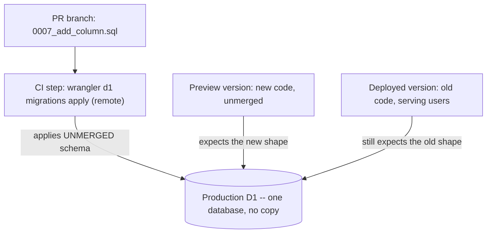

## Overview

A preview URL feels like a staging environment. It is not one. A preview
version is a non-active version of the **same Worker**, and per
[Cloudflare's versions and deployments docs](https://developers.cloudflare.com/workers/versions-and-deployments/),
a version captures "its bundled code, static assets, bindings, and
compatibility settings." The bindings come along unchanged: the same D1
database, the same KV namespace, the same AI binding, and the same
`SLACK_BOT_TOKEN` — which means the same Slack workspace and the same real
channels that token can post to.

Nothing about the preview is sandboxed. That single fact is what makes
database migrations in a PR-preview workflow a production concern, and it is
the reason a production reference integration ended up treating additive-only
DDL as a rule enforced in CI rather than a convention.

## Storage state is not versioned

The binding is versioned; the data behind it is not. Cloudflare states this
directly:

> State changes for associated
> [storage resources](https://developers.cloudflare.com/workers/platform/storage-options/)
> such as KV, R2, Durable Objects, and D1 are not tracked with versions.

Two consequences follow, and both bite in practice:

- A preview version reads and writes the **live** rows. There is no copy.
- Rolling a Worker version back does **not** roll a schema change back. Code
  is reversible; the migration you applied to get the preview working is not.

## What a preview needs, and what that costs

A preview is only useful if it runs. If a PR adds a column and the new code
selects it, the preview returns errors until that migration has been applied
to the database the preview binds to — the production one. So CI grows a step
that applies each PR's migrations before uploading the preview version.

That step is the whole problem in one line: **it applies unmerged schema
changes to production D1 while the currently deployed Worker is still serving
traffic against the old schema.**



The window between "CI applied the migration" and "the PR merged and
deployed" can be minutes or days. For the whole of it, the live Worker is
running against a schema it was not written for.

## The rule: additive-only DDL

The live Worker must keep working against the changed schema without being
redeployed. That reduces to one rule — **only add**:

| Statement | Safe before merge? | Why |
|---|---|---|
| `CREATE TABLE new_table (...)` | Yes | The live Worker never names it |
| `ALTER TABLE t ADD COLUMN c TEXT` (nullable) | Yes | Existing `INSERT`s and `SELECT`s stay valid |
| `ALTER TABLE t ADD COLUMN c INTEGER NOT NULL DEFAULT 0` | Yes | Existing rows get the default |
| `CREATE INDEX ...` | Yes | Query results are unchanged |
| `DROP TABLE` / `ALTER TABLE ... DROP COLUMN` | No | The live Worker still reads it |
| Renaming or retyping a column | No | A rename is a drop and an add to the live Worker |
| `DELETE FROM` / `UPDATE` without a guard | No | Destroys production rows outright |

`NOT NULL` without a default is not merely discouraged here — SQLite rejects
it. Per
[SQLite's `ALTER TABLE` documentation](https://www.sqlite.org/lang_altertable.html),
a column added with `ADD COLUMN` may not be `NOT NULL` unless it has a
non-`NULL` default, because existing rows would have nothing to hold.

Removals still happen; they just happen **later**, as their own PR, after the
Worker that stopped reading the old column is already deployed. Add and
backfill in one change, stop reading in the next, drop in a third. Each step
leaves both the old and the new code able to run.

:::warning[A "safe" additive column can still break a live `SELECT *`]
Additive DDL is safe for code that names its columns. A live Worker that does
`SELECT *` and feeds the row into a strict runtime validator — a schema that
rejects unknown keys — will start failing the moment the new column appears,
without anyone deploying anything. Either name columns explicitly in queries,
or make the validator tolerant of extra keys, before relying on this rule.
:::

## Enforcing it in CI

The rule only holds if something mechanical checks it, because the failure is
invisible at review time — the diff looks like a normal migration, and the
damage happens on a machine.

```sh
#!/usr/bin/env bash
# Fails the PR when a NEW migration file contains destructive SQL.
# Preview versions bind the production D1, so CI applies these before merge.
set -euo pipefail

pattern='DROP[[:space:]]+(TABLE|INDEX|VIEW)'
pattern="$pattern"'|ALTER[[:space:]]+TABLE[[:space:]]+[^[:space:]]+[[:space:]]+DROP'
pattern="$pattern"'|DELETE[[:space:]]+FROM'
pattern="$pattern"'|UPDATE[[:space:]]+[^[:space:]]+[[:space:]]+SET'

found=0
while IFS= read -r file; do
  [ -n "$file" ] || continue
  if grep -inE "$pattern" "$file"; then
    echo "  ^ destructive SQL in $file"
    found=1
  fi
done < <(git diff --name-only --diff-filter=A "$BASE_SHA...HEAD" -- 'migrations/*.sql')

if [ "$found" -eq 1 ]; then
  echo
  echo "Preview deploys apply migrations to PRODUCTION D1 before this PR merges."
  echo "Rewrite as additive-only DDL, or apply the override label."
  exit 1
fi
```

`UPDATE` and `DELETE` are flagged wholesale rather than only when unguarded.
A `WHERE` clause can sit three lines below the verb, so "unguarded" is not
something a line-oriented scan can decide; a human decides, and says so by
applying the override label below.

## The override label means "I accept a production break"

Some migrations genuinely have to be destructive. The escape hatch is a
GitHub label a person applies by hand — never something CI can grant itself:

```yaml
on:
  pull_request:
    # labeled / unlabeled are required here: without them, applying the
    # override label does not re-run this check, and the PR stays red.
    types: [opened, synchronize, reopened, labeled, unlabeled]

jobs:
  guard-migrations:
    runs-on: ubuntu-latest
    if: ${{ !contains(github.event.pull_request.labels.*.name, 'accept-production-break') }}
    steps:
      - uses: actions/checkout@v4
        with:
          fetch-depth: 0
      - run: ./scripts/check-migrations.sh
        env:
          BASE_SHA: ${{ github.event.pull_request.base.sha }}
```

Write the label's meaning down where the label is defined, in these words:
**applying this label accepts a production break that lasts until this PR
merges.** The two halves of that sentence are not symmetrical. The outage
ends at merge; rows destroyed by a `DROP` or a `DELETE` do not come back when
the PR merges, and they do not come back when the Worker version is rolled
back either.

## Back up before using the escape hatch

The precondition for the override label is an export taken first, per
[Cloudflare's D1 import/export docs](https://developers.cloudflare.com/d1/best-practices/import-export-data/):

```sh
npx wrangler d1 export <database_name> --remote --output=backup.sql
```

Two documented limits shape when this runs: "A running export will block
other database requests," so take it during a quiet window rather than
mid-incident, and export is not supported for databases containing virtual
tables (D1's FTS5 full-text search tables), which have to be dropped and
recreated around the export.

## The default path is local D1

Almost every migration never needs any of the above, because it can be
verified against a real SQLite schema with zero production exposure:

```sh
npx wrangler d1 migrations apply <database_name> --local
npx wrangler dev
```

This is the same migration files, the same engine, and the same queries —
just a local database. Cloudflare's
[D1 local development docs](https://developers.cloudflare.com/d1/best-practices/local-development/)
confirm the flag is the whole difference: "Without the `--local` flag, the
commands are executed against the remote version of your D1 database running
on Cloudflare's network." Reach for the preview-against-production path only
when the thing being tested is genuinely about production data volume or
production rows.

## Gotchas

- **Dropping `--local` silently targets production.** The commands are
  otherwise identical, there is no confirmation prompt, and the flag is easy
  to lose when a command gets copied into a script. Treat any `wrangler d1`
  invocation without `--local` as a production write.
- **The preview shares the Slack bot token, not just the database.** A
  preview version that posts a test message posts it to the real channel, in
  front of real people, from the real bot. Route test posts to a dedicated
  channel by configuration, not by hoping the preview is isolated.
- **A version rollback does not undo a migration.** Because storage state is
  not tracked with versions, the rollback restores the code that expects the
  old schema and leaves the new schema in place — which can be strictly worse
  than the state you rolled back from.
- **Two concurrent PRs can generate the same migration filename.** Applied
  migrations are recorded by name in the `d1_migrations` table, so if both
  PRs produce `0007_*.sql` with the same name, whichever applies first is
  recorded and the second is treated as already applied and never runs.
  Rebase before generating a migration, and check the highest existing number
  on the base branch rather than on your branch.
- **Additive-only is a constraint on the *live* Worker, not on the PR.** The
  question to ask about any migration is never "does the new code still
  work?" — it is "does the code that is deployed right now still work?"
